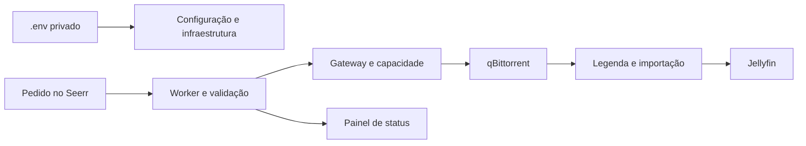

# HomeServer

HomeServer organiza uma biblioteca de filmes e séries com Jellyfin, Seerr,
Sonarr/Radarr, Prowlarr, Bazarr e qBittorrent. Um controlador próprio coordena
aquisições, capacidade, legendas e importação; SQLite guarda o estado e Docker
Compose separa as redes. A instalação usa Ubuntu Server 24.04 LTS amd64, Python
3.12, uv 0.8.0 e systemd. CPU é o padrão; Intel UHD é uma opção explícita.

O `.env` privado é a única configuração editável do operador. Ele gera Compose,
units e preferências nativas. Aquisições passam pelo gateway e pela reserva de
bytes reais; produção exige a montagem de mídia com o UUID esperado. O painel
HTTP mostra métricas e prontidão. CYD e MQTT não fazem parte da distribuição.



| Serviço | Função | URL configurável no `.env` |
|---|---|---|
| Jellyfin | Biblioteca e reprodução | `JELLYFIN_PUBLIC_URL` |
| Seerr | Catálogo e pedidos | `SEERR_PUBLIC_URL` |
| Sonarr / Radarr | Séries / filmes e fontes disponíveis | `SONARR_PUBLIC_URL` / `RADARR_PUBLIC_URL` |
| Prowlarr | Indexadores | `PROWLARR_PUBLIC_URL` |
| Bazarr | Provedores de legendas | `BAZARR_PUBLIC_URL` |
| qBittorrent | Transferências e peers; monitor somente leitura | `QBIT_MONITOR_PUBLIC_URL` |
| Painel HomeServer | Rede, CPU, memória, armazenamento e estado dos serviços | `STATUS_PUBLIC_URL` |

As chaves usam o prefixo `HOMESERVER_`. Os cards do painel abrem esses serviços.
Filmes respeitam qualidade antes de seeds; séries mantêm temporada/episódio em
sequência. Pisos de tamanho/duração recusam encodes pequenos, sem teto fixo por
arquivo. Legendas priorizam pt-BR e usam inglês como fallback; veja a
[política de qualidade e idiomas](docs/configuration.md#parâmetros-de-operação).

## Começar

Siga [instalação fresh/adopt](docs/installation.md), depois o
[guia do operador](docs/operator-guide.md). O [catálogo de configuração](docs/configuration.md)
descreve tipos, unidades e segredos; [configuração dos serviços](docs/runbooks/service-setup.md)
explica a adoção de IDs e contas nativas.

```bash
git clone https://github.com/reisguilherme/homelab-mediaserver.git
cd homelab-mediaserver
uv sync --frozen
uv run --frozen scripts/homeserver env init --env-file .env.dev --mode dev
uv run --frozen scripts/homeserver config validate --env-file .env.dev --mode dev
```

Esse exemplo prepara desenvolvimento. Instalação em produção também exige
disco já montado, dependências do host, credenciais e release com imagens por
digest. O projeto não formata discos, substitui `fstab` ou altera o roteador.

## Desenvolvimento

```bash
uv sync --frozen
uv run make lint
uv run make test-unit
uv run make test-contract
uv run make compose-check
```

Use Linux/WSL2 com Python 3.12 e uv 0.8.0. Execute também
`uv run make test-integration smoke` quando as dependências locais estiverem
disponíveis. Fixtures usam `.runtime/dev`, mídia sintética e loopback; não copie
bancos, tokens, mídia ou inventário bruto do servidor para o checkout.

`make test-config`, `make test-install` e `make test-restic` selecionam as
fixtures desses fluxos. Para testar APIs nativas reais, prepare as imagens
`homeserver-control:dev` e `homeserver-telemetry:dev` pelos Dockerfiles em `deploy/`
e execute `uv run make test-fresh-stack` com Docker/Compose disponível.
O validador cria um projeto CPU isolado, portas loopback aleatórias e diretório
privado novo em `.runtime/fresh-*`; não importa estado existente, configura
indexadores vazios/provedores desabilitados e não adiciona torrents. Verifica
bootstrap dos sete serviços, segundo apply sem diff, mudança de fila qBit e
read-back/prontidão com snapshots recentes. Remove somente containers/redes do
projeto criado e conserva os arquivos privados da fixture. Docker indisponível
retorna exit 3; esse resultado não é aceite real. `--root` aceita um diretório
novo explícito e `--timeout` limita a espera de APIs/prontidão a 300 s por padrão.
Consulte [contribuição](CONTRIBUTING.md), [segurança](SECURITY.md) e
[histórico de mudanças](CHANGELOG.md).

## Implantação

Uma release é produzida a partir de um checkout limpo por
`scripts/build-release.sh --image-prefix <registry/namespace/prefix> --output <diretório>`.
Ela contém SHA, manifesto, compatibilidade de banco, checksums e imagens por
digest. `scripts/deploy.sh` e `scripts/rollback.sh` usam o mesmo caminho validado
localmente; a publicação e o deploy de produção são manuais.

Consulte [arquitetura](docs/architecture.md),
[diagnóstico e recuperação](docs/troubleshooting.md) e
[releases](docs/runbooks/releases.md). Limites novos são quatro downloads, oito
seedings, doze torrents ativos e upload de 20 Mbit/s; adopt preserva o valor
efetivo existente até um diff explícito. Não há reserva fixa de 80 GB nem teto
estático de tamanho por filme/episódio.

Os testes locais comprovam contratos e comportamento com fixtures. O ensaio
completo em outra máquina, montagem real, rede/Tailscale, Intel UHD e reprodução
precisam de evidência própria. Windows/WSL não substituem o aceite do hardware.
O [registro de implementação e aceite](docs/evidence/productization-acceptance.md)
informa quais ensaios passaram e quais etapas de publicação/ativação faltam.
