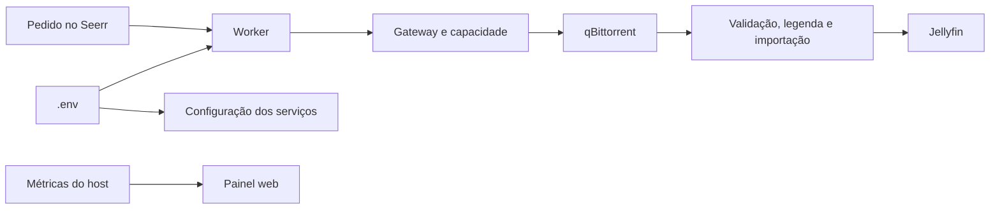

# HomeServer

HomeServer reúne Jellyfin, Seerr, Sonarr, Radarr, Prowlarr, Bazarr e qBittorrent
para organizar filmes e séries em um servidor pessoal Ubuntu. Um controlador
coordena downloads, espaço disponível, legendas, importação e exclusões
solicitadas pelo Jellyfin. O painel web mostra o estado do servidor e abre os
painéis nativos dos serviços.

A instalação usa Docker Compose. Preferências e credenciais ficam no `.env`;
caminhos, portas e redes internas têm defaults no código e no Compose. CPU é
o padrão, com [Intel UHD opcional](docs/runbooks/jellyfin-hardware.md).
CYD, MQTT exclusivo, CI/CD, releases próprias e backup do serviço foram retirados.



## Instalar e executar

Siga [a preparação de Ubuntu, Docker e Tailscale](docs/installation.md). No
checkout, copie `.env.example` para `.env`, gere os tokens indicados no guia e
preencha as senhas. Com os diretórios de dados preparados:

```bash
docker compose up -d --build
docker compose run --rm operator config apply --env-file /project/.env --in-container
docker compose restart control-api control-worker download-gateway telemetry host-metrics
```

O serviço de inicialização prepara configurações ausentes. O operator conecta
as APIs e aplica as preferências; preserve as credenciais reais ao reutilizar
dados de outra instalação. Consulte [configuração](docs/configuration.md) e
[operação](docs/operator-guide.md) para alterações posteriores.

A [expansão SSD + HD USB](docs/storage.md) usa um override opcional,
`compose.storage.yaml`, após verificar os UUIDs, a união mergerfs e uma fixture
de hardlink como UID 1000. O gateway escolhe um disco que comporte o torrent
inteiro, com preferência pelo SSD; o painel mostra cada pool separadamente.

## Acessar

Use `http://IP_DO_SERVIDOR:PORTA` na rede doméstica ou o IP Tailscale do servidor.
Os cards do painel em `8081` abrem os aplicativos.

| Serviço | Porta | Função |
|---|---|---|
| Painel HomeServer | 8081 | CPU, memória, rede, armazenamento e serviços |
| Jellyfin | 8096 | Biblioteca e reprodução |
| Seerr | 5055 | Catálogo e pedidos |
| Sonarr | 8989 | Séries, fontes e importações |
| Radarr | 7878 | Filmes, fontes e importações |
| Prowlarr | 9696 | Indexadores |
| Bazarr | 6767 | Provedores de legendas |
| Controle HomeServer | 8080 | API autenticada de controle |
| Monitor qBittorrent | 18080 | Progresso, velocidade e peers; somente leitura |

O monitor qBit fica em loopback. Publique-o dentro da tailnet com
[encaminhamento TCP Tailscale Serve](docs/installation.md#acesso-pelo-tailscale)
e abra `http://IP_TAILSCALE:18080`. A API nativa qBit
é interna ao Compose.

## Preferências

O `.env` permite ajustar downloads simultâneos, banda, conexões,
resoluções, fontes, Dolby Vision/Atmos, idiomas, legendas, indexadores e busca
de alternativas. O padrão permite 10 downloads e seeding sem limite de arquivos,
com upload limitado a 20 Mbit/s. A seleção usa UIndex primeiro e 1337x como
alternativa para fontes ausentes ou com poucos seeds. Filmes preferem 4K,
com fallback em 1080p; séries usam 1080p com piso de tamanho por duração.
Temporadas completas e a mesma família de releases são preferidas quando elegíveis.
Episódios podem baixar em paralelo, com janela configurável; a importação
no Jellyfin mantém a sequência de temporada e episódio. Capacidade usa bytes reais
pendentes, sem reserva fixa por filme nem teto de tamanho.

Legendas priorizam pt-BR da mesma release, pt-BR de edição compatível, inglês
da mesma release e inglês de edição compatível. Áudio original brasileiro
comprovado pode dispensar legenda. Veja [as regras e unidades](docs/configuration.md).

No Jellyfin Web, o menu `…` permite excluir um episódio ou uma temporada
inteira com a conta administradora autorizada. O controlador coordena a limpeza
no Sonarr, qBit e Seerr, preservando outras temporadas. Marcar como assistido
não remove arquivos. Veja [como excluir e acompanhar](docs/operator-guide.md#remover-mídia-assistida).

## Desenvolver

Use Linux/WSL2, Python 3.12 e `uv sync --frozen`.

```bash
uv sync --frozen
uv run make lint
uv run make test-unit
uv run make test-contract
uv run make test-integration
uv run make smoke
uv run make compose-check
```

O [guia de desenvolvimento](docs/development.md) descreve fixtures e ferramentas
opcionais. Consulte também [arquitetura](docs/architecture.md),
[diagnóstico](docs/troubleshooting.md), [contribuição](CONTRIBUTING.md) e
[segurança](SECURITY.md). Testes locais não comprovam rede, GPU ou reprodução
em outra máquina.

O [registro de aceite da stack pessoal](docs/evidence/personal-compose-acceptance.md)
distingue a suíte local, o primeiro boot isolado e a ativação no servidor.
