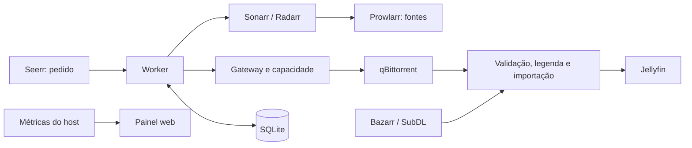

# Arquitetura

HomeServer reúne serviços de mídia e um controlador Python com SQLite.
A stack é iniciada pelo `compose.yaml` da raiz. O `.env` contém credenciais e
preferências editáveis; paths, portas e URLs internas têm defaults no projeto.

O worker escolhe fontes elegíveis e reserva os bytes pendentes reais.
Episódios podem baixar em paralelo na janela configurada por série;
a importação no Jellyfin mantém temporadas e episódios em ordem estrita. A fonte atual continua durante a avaliação
de uma alternativa; qualidade e edição governam a recuperação. Troca por
velocidade está desligada por padrão e pode ser habilitada no `.env`.
Seeds anunciados são um sinal de disponibilidade, não garantia de throughput.

Antes de publicar no Jellyfin, o fluxo valida arquivo, legenda e importação.
Sonarr/Radarr mantêm Completed Download Handling desabilitado e hardlinks
habilitados: o worker coordena a importação e o torrent pode continuar seedando
sem uma segunda cópia física do vídeo.

O operator é um comando pontual do Compose para aplicar preferências nativas,
com leitura antes/depois e IDs preservados. O init prepara configurações
ausentes; bancos existentes não são substituídos.

`/srv/appdata` guarda bancos/configurações dos aplicativos. Torrents e biblioteca
compartilham `/srv/data`; transcode usa `/srv/transcode`. Estado/snapshots do
controle ficam em `/srv/appdata/control`, montado como `/run/homeserver` nos
containers. A API nativa qBit não
tem porta publicada. Jellyfin passa pelo proxy de exclusão explícita e o
monitor qBit passa por proxy somente leitura.

O container de métricas lê CPU, memória, rede e filesystem do host e alimenta
o painel. A operação cotidiana usa Compose; não há gerenciador de releases,
backups, units do host ou CI/CD. Os documentos de produtização anteriores
registram uma abordagem que foi retirada do escopo.
