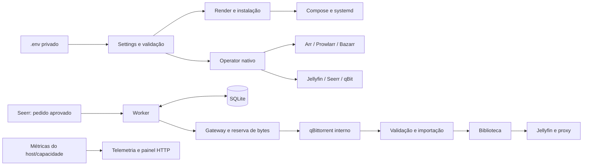

# Arquitetura

HomeServer usa serviços de mídia existentes, um controlador Python e SQLite
local. O `.env` do operador passa por um loader sem avaliação de shell. O schema
único exporta configuração tipada, catálogo e valores normalizados; render gera
Compose/units, e reconciliadores administrativos aplicam preferências nativas.

## Configuração e interfaces

`services/common/src/homeserver_common/` contém loader/schema/catalog, CLI,
render, instalação, supervisão, Restic e releases; é biblioteca compartilhada,
não um daemon adicional. `scripts/homeserver` oferece env init,
config validate/show/catalog/plan/apply/verify, install plan/apply, render,
doctor e backup create/verify/copy/restore.

`services/control/` contém API, worker, gateway, adapters, configuração nativa e
persistência. Native settings têm ownership de chaves/recursos, IDs estáveis,
read-before-write e read-back. Resultado parcial é reportado por serviço com
segredos redigidos. APIs sem capacidade necessária retornam unsupported.
Sonarr/Radarr mantêm `enableCompletedDownloadHandling=false` e
`copyUsingHardlinks=true`: o worker conserva ownership da validação/importação,
enquanto os hardlinks permitem seeding sem duplicar os bytes do vídeo.

`services/telemetry/` serve painel HTTP e saúde usando snapshots compactos do
host e do filesystem. Não há dependência de CYD/MQTT. Snapshots expõem idade;
dados ausentes não são apresentados como medidos.

## Redes e armazenamento

`apps`, `transfer` e `telemetry` separam tráfego interno. Apps com necessidade
externa recebem rede de egress explícita. qBittorrent permanece na rede transfer;
apenas peers têm bind TCP/UDP separado. O monitor autenticado é limitado ao
Tailscale/loopback. Novos downloads usam o gateway e sua reserva, sem uma API
pública adicional de mutação.

Media root é guardado por UUID antes de produção escrever. Torrents e biblioteca
compartilham `/data` para hardlinks; host roots/UID/GID vêm do `.env`. Bancos e
tokens ficam em appdata privado, transcode e backup staging em roots separados.
Jellyfin lê biblioteca; proxy intermedeia operações de exclusão explícitas para
preservar o estado do controlador. Não existe limpeza automática de mídia.

## Aquisição e recuperação

Admissão usa bytes pendentes reais e capacidade recente; reservas SQLite evitam
dupla alocação. Não há teto por filme/episódio nem reserva fixa de 80 GB. A ordem
das séries é sequencial e a política de qualidade/idioma é derivada do schema.
O piso de tamanho usa vídeo principal e duração declarada; áudio só recebe
preferência pelos metadados de idioma da release. `original` depende de contexto
Arr, e região desconhecida não comprova pt-BR. A dispensa de legenda tem detector
próprio e aceita somente original pt-BR comprovado, ou fica desabilitada.

Avaliação de alternativa mantém a fonte atual, reserva os bytes de ambas e mede
desempenho antes de promoção. Qualidade/edição e ETA governam a troca. Políticas
de pausa, cancelamento, proteção de hash e recovery precedem efeitos externos.
Legendas usam prioridades por idioma/release/edição e a mídia é validada antes
da importação/publicação.

systemd executa supervisor e métricas. Compose não depende de restart ilimitado:
supervisor faz tentativas limitadas e respeita maintenance, recovery e UUID.
Host snapshots, heartbeat e readiness tornam processo vivo diferente de serviço
pronto. Operações de backup/release compartilham lock e barreira de manutenção.
Cada ciclo tem prazo fixo; atualizar o heartbeat durante trabalho não estende
esse prazo nem simula um ciclo concluído. Readiness bloqueia admissão quando
não há progresso válido dentro dos limites configurados.

Restic captura SQLite/configurações/releases consistentes, sem mídia, e copia
para outro repositório com retenção independente. Restore publica somente uma
árvore isolada validada e mantém admissão desligada. Releases identificadas por
SHA validam manifesto/digests/checksums e compatibilidade de banco; rollback
não implica restaurar estado antigo.

## Limite da evidência

Unitários, contratos HTTP e integrações com filesystem temporário verificam o
código; o ensaio fresh/adopt em outra máquina e o aceite físico continuam
dependentes do ambiente real. Informações declaradas não equivalem a UUID,
Intel, rede, energia ou playback comprovados. Veja [instalação](installation.md),
[operação](operator-guide.md) e [diagnóstico](troubleshooting.md).
