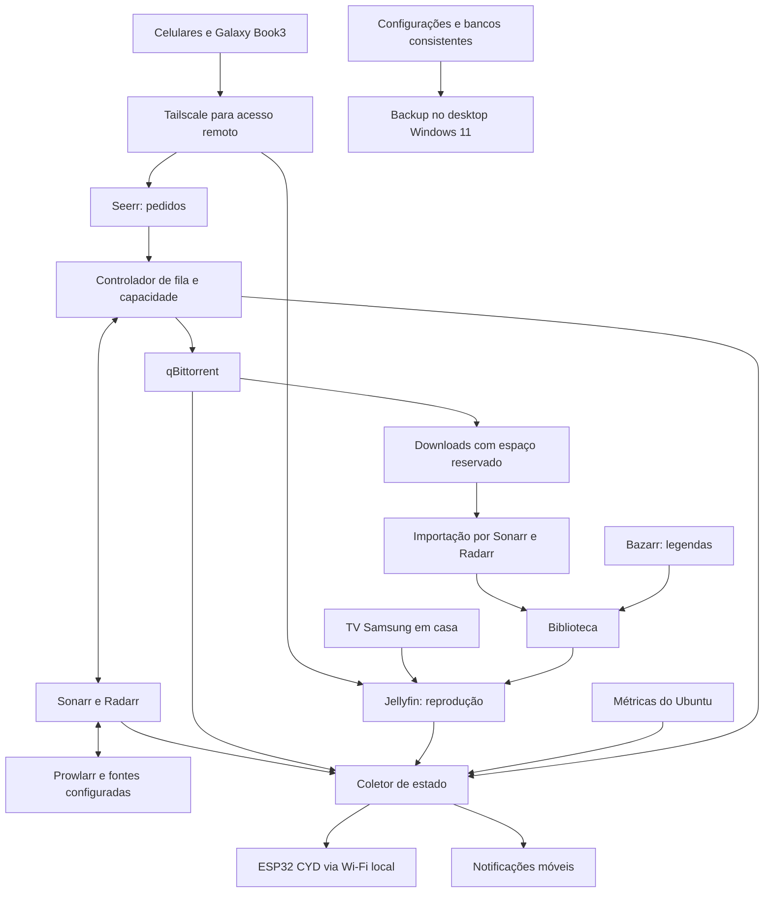

# HomeServer — Escopo detalhado do projeto

**Versão:** 1.3 — 21 de setembro de 2026

**Responsável:** Guilherme

**Status:** requisitos consolidados a partir da conversa; arquitetura proposta para revisão

**Objetivo desta entrega:** documentar o escopo, as decisões, os critérios de aceite e a sequência de implantação. A base do servidor já foi preparada pelo usuário conforme a seção 3.2; o desenvolvimento das aplicações será realizado no desktop.

## 1. Objetivo e resultado esperado

Transformar um Lenovo Legion 5i em servidor doméstico de mídia, operando continuamente, com solicitação de filmes e séries pelo celular, busca automatizada de torrents, organização da biblioteca e reprodução pelo Jellyfin dentro e fora de casa.

Uma ESP32 CYD exibirá o estado dos serviços, os downloads em andamento e indicadores do servidor. O projeto deve preservar o espaço disponível e a capacidade de upload da conexão doméstica, permitir exclusão manual coordenada e manter backups das configurações no desktop com Windows 11.

O resultado esperado é o seguinte fluxo:

1. O usuário acessa o portal de solicitações pelo celular, usando Tailscale quando estiver fora de casa.
2. Solicita um filme ou série, com aprovação automática para sua conta.
3. O sistema procura opções que atendam aos critérios de resolução, idioma e tamanho.
4. Verifica capacidade e reserva espaço antes de liberar downloads.
5. Baixa, valida, importa e disponibiliza o conteúdo no Jellyfin.
6. Atualiza o painel físico e envia uma notificação quando o conteúdo estiver pronto.
7. Mantém o torrent compartilhando com upload limitado até a exclusão manual do conteúdo.

**Meta de reprodução:** até duas sessões simultâneas, buscando 4K local e remoto. São resultados aceitáveis 4K + 4K quando viável, 4K + 1080p ou 1080p + 1080p. A combinação efetivamente suportada será medida nos dispositivos reais.

## 2. Como interpretar este documento

- **Confirmado:** escolha expressa pelo usuário durante o levantamento.
- **Proposto:** solução técnica ou parâmetro inicial recomendado para atender às escolhas confirmadas.
- **Validação necessária:** verificação objetiva que será feita antes de consolidar uma configuração de produção.

As propostas numéricas de reservas, intervalos e retenção são parâmetros iniciais ajustáveis. Não devem ser confundidas com decisões já tomadas pelo usuário. As validações estão concentradas na seção 20, com resultado esperado e momento de resolução.

Os limites de tamanho são interpretados como **GB decimais: 1 GB = 1.000.000.000 bytes**. Interfaces que mostrem GiB exigem conversão. Essa convenção é uma proposta para eliminar ambiguidades de implementação.

## 3. Inventário e condições existentes

| Item | Configuração confirmada | Implicação |
|---|---|---|
| Servidor | Lenovo Legion 5i | Notebook dedicado ao servidor |
| Processador | Intel Core i7-10750H | Processamento dos serviços e uso da GPU integrada |
| Memória | 16 GB de RAM; frequência informada inicialmente como 3000 MHz | Capacidade/frequência efetivas serão inventariadas no Ubuntu |
| Armazenamento | Dois SSDs NVMe de 512 GB; um dedicado montado em `/srv/data` | Somente esse SSD será usado para mídia na versão 1; preservar as montagens atuais |
| GPU dedicada | RTX 2060 queimada e desativada na BIOS | Não será utilizada nem contabilizada como recurso disponível |
| GPU ativa | Intel UHD | Aceleração de vídeo a validar; usuário relata funcionamento estável |
| Sistema | Ubuntu Server instalado do zero | Sem preservação de Windows no Legion |
| Operação | Ligado 24 horas por dia | Exige configuração de energia, monitoramento e recuperação |
| Rede do servidor | Cabo CAT6 até o roteador | Velocidade negociada da porta será medida |
| Internet | 500 Mbps de download; aproximadamente 100 Mbps de upload medido via cabo | Upload será compartilhado entre reprodução remota e seeding |
| Painel | ESP32-2432S028 já disponível | Revisão da placa, controlador e touch serão identificados |
| Backup | Desktop Windows 11 ligado com frequência | Destino pode estar temporariamente indisponível |

O relato de estabilidade com a RTX desativada permite seguir com o planejamento. O aceite de operação contínua depende de teste térmico e de estabilidade no Ubuntu com a carga prevista.

### 3.1 Dispositivos de acesso

| Dispositivo | Uso previsto |
|---|---|
| iPhone 16 Pro | Solicitações, notificações e reprodução local/remota |
| Samsung Galaxy S25 | Solicitações, notificações e reprodução local/remota |
| Galaxy Book3 360 | Reprodução local/remota e saída de vídeo para TV |
| Samsung Crystal UHD 58 polegadas, linha 2024 | Reprodução em casa; código exato ainda necessário |
| TVs durante viagens | Galaxy Book3 conectado por HDMI, com Tailscale no notebook |

Uma tela pode receber um arquivo 4K e exibi-lo em sua resolução física. O teste deve distinguir resolução do arquivo, resolução transmitida e resolução efetivamente apresentada pelo dispositivo.

### 3.2 Base já preparada pelo usuário

Estado informado pelo usuário, ainda sem auditoria remota nesta tarefa:

- OpenSSH ativo no systemd para acesso pela LAN.
- Tailscale instalado no host, nó autenticado e Tailscale SSH ativado.
- `/etc/systemd/logind.conf.d/server-power.conf` com `HandleLidSwitch=ignore`, `HandleLidSwitchExternalPower=ignore` e `IdleAction=ignore`.
- Targets de suspensão e hibernação mascarados no systemd.
- Conservação de bateria Lenovo configurada e persistida por `lenovo-conservation.service`, com faixa de carga relatada de 55–60%.
- `nouveau` em blacklist e initramfs atualizado; RTX permanece desativada na BIOS.
- Docker Engine e Compose instalados por repositórios oficiais; usuário existente no grupo `docker`.
- SSD identificado atualmente como `nvme0n1` montado em `/srv/data` por UUID no fstab, com `noatime`.
- Diretórios `/srv/data/torrents`, `/srv/data/media`, `/srv/appdata`, `/srv/transcode` e `/srv/backup-staging` criados, com permissões 775 relatadas e teste de hardlinks concluído.

O plano começará por inventariar versão do Ubuntu, UUID, tipo de sistema de arquivos, proprietários/UID/GID, render device Intel e regras de acesso. Não repetir instalação, formatação ou mudanças de energia sem necessidade demonstrada. Nomes `nvme*` não substituem identificação por UUID. Teste de hardlink no host deverá ser complementado com teste dentro dos containers. O mascaramento dos targets pertence ao systemd; a blacklist de um módulo não comprova, sozinha, isolamento de toda a GPU.

## 4. Decisões de produto confirmadas

| ID | Decisão |
|---|---|
| D01 | Uso pessoal, somente o usuário e seus dispositivos inicialmente |
| D02 | Até duas reproduções simultâneas |
| D03 | Priorizar 4K em casa e fora; aceitar redução de reprodução para 1080p |
| D04 | Downloads em 4K preferencialmente, com 1080p como resolução mínima |
| D05 | Dentro da mesma classe de qualidade, preferir dual áudio original + português brasileiro quando confirmado |
| D06 | Na ausência de dual áudio, aceitar áudio original somente com legenda em português brasileiro confirmada |
| D07 | Filmes sem teto fixo de tamanho; admitir pelo total inspecionado do torrent e espaço livre real |
| D08 | Episódios e temporadas sem teto fixo; contabilizar cada torrent conhecido e a fila pendente |
| D09 | Solicitar todas as temporadas disponíveis de uma série e acompanhar futuros episódios |
| D10 | Temporadas completas admitem cada episódio conhecido quando couber; não reservar episódios sem torrent |
| D11 | Temporadas em lançamento não ocupam espaço antes da inspeção do episódio liberado |
| D12 | Não substituir automaticamente uma versão válida por outra de qualidade ou áudio melhores |
| D13 | Biblioteca rotativa com exclusão manual; sem apagar automaticamente conteúdos assistidos |
| D14 | Exclusão deve remover biblioteca, torrent e dados correspondentes e impedir redownload automático |
| D15 | Pedidos sem espaço permanecem pendentes e retomam automaticamente após liberação de capacidade |
| D16 | Manter seeding até a exclusão manual, desde que não prejudique o upload da rede |
| D17 | Usar Tailscale para acesso remoto; sem VPN adicional para saída dos torrents |
| D18 | Usar somente o SSD já montado em `/srv/data` para mídia na versão 1; a escolha anterior de aproveitar os dois discos foi substituída pelo usuário |
| D19 | CYD somente para monitoramento; sem controles de serviços ou downloads na primeira versão |
| D20 | Receber alertas no celular; canal sem preferência prévia |
| D21 | Backups das configurações e bancos de dados no desktop Windows 11 |
| D22 | Fontes e indexadores serão selecionados durante a implantação |
| D23 | Desenvolvimento principal no desktop; implantação inicial no Ubuntu por SSH via Tailscale |
| D24 | Adotar GitHub Actions após validar a implantação manual, com testes automáticos e implantação inicialmente acionada pelo usuário |
| D25 | Codex CLI no Ubuntu será opcional para configuração e diagnóstico; mudanças devem ser registradas no mesmo repositório |
| D26 | Entregar um script `.sh` executável no Ubuntu recém-instalado para preparar as bases necessárias ao projeto, com execução repetível e verificações de resultado |

## 5. Limites do escopo

### 5.1 Incluído na versão 1

- Preparação do Ubuntu, discos, rede, energia, acesso administrativo e inicialização automática.
- Implantação e integração de Jellyfin, Seerr, Sonarr, Radarr, Prowlarr e qBittorrent.
- Busca de legendas em português como parte do fluxo, com Bazarr proposto.
- Acesso remoto privado com Tailscale nos dispositivos compatíveis.
- Automação complementar de fila, limites, reservas de espaço e exclusão coordenada.
- Perfil de qualidade que prefira 4K e admita cada torrent pelo tamanho real disponível.
- Monitoramento do servidor, dos serviços, dos downloads e das reproduções.
- Firmware e configuração do painel CYD.
- Notificações móveis, backups e procedimento de restauração.
- Documentação de operação e testes de aceite.
- Fluxo de desenvolvimento no desktop, implantação reproduzível por SSH e posterior automação com GitHub Actions.
- Script de preparação inicial do servidor, com dependências, configuração básica, diagnóstico e instruções de execução em uma instalação limpa.

### 5.2 Fora da versão 1

- Streaming de arquivos ainda incompletos durante o download.
- Garantia de encontrar todo conteúdo solicitado ou toda combinação de idioma/legenda.
- Garantia de duas transcodificações 4K simultâneas em qualquer codec ou cenário de HDR.
- Download de versões 720p ou inferiores.
- Manutenção automática de cópias 4K e 1080p do mesmo título.
- Upgrades automáticos, remoção por histórico de reprodução ou limpeza automática da biblioteca.
- Uso, conserto ou reativação da RTX 2060.
- Hospedagem pública dos serviços ou acesso direto pelo aplicativo de uma TV de hotel.
- VPN comercial de saída, Gluetun e infraestrutura própria de VPN.
- Música, livros, IPTV, televisão ao vivo e outras categorias da suíte Arr.
- Contas de terceiros, aprovação de pedidos de convidados e gestão de múltiplos usuários.
- Kubernetes, Proxmox, alta disponibilidade ou segundo servidor.
- Compra de novos discos, NAS, UPS ou dispositivos de streaming.
- União dos dois SSDs para mídia, mergerfs e migração do layout atual na versão 1.
- Backup integral dos filmes, episódios e dados dos torrents.
- Comandos de administração pela CYD e histórico extenso com Grafana/Prometheus.

## 6. Arquitetura proposta

### 6.1 Escolha da plataforma

Ubuntu Server já está instalado diretamente no hardware, com Docker e Tailscale no host. Preservar a versão existente se suportada pelas dependências; registrar versão, kernel, drivers e imagem Jellyfin após a auditoria. A proposta inicial de Ubuntu 24.04 LTS não é uma instrução para reinstalar o servidor. As imagens dos serviços terão versões controladas.

| Alternativa | Avaliação para este projeto |
|---|---|
| Ubuntu direto + Compose | Recomendado: administração simples e acesso direto à GPU integrada |
| Proxmox + máquina virtual | Acrescenta virtualização e passagem de GPU sem uma necessidade confirmada |
| Plataforma de NAS | Alternativa futura; hoje acrescenta escolhas de plataforma sem resolver por si só as regras personalizadas |

### 6.2 Diagrama lógico



O diagrama representa responsabilidades. A integração de pedidos com o controlador é uma parte a desenvolver e validar; não pressupõe um mecanismo nativo de reserva por temporada no Seerr ou no Sonarr.

### 6.3 Responsabilidades dos componentes

| Componente | Responsabilidade e dados persistidos |
|---|---|
| Jellyfin | Catálogo de reprodução, usuários, progresso e configurações |
| Seerr | Descoberta, solicitações e visibilidade de disponibilidade |
| Sonarr | Catálogo de séries, episódios, monitoramento e importação |
| Radarr | Catálogo de filmes, perfis e importação |
| Prowlarr | Integração e estado dos indexadores |
| qBittorrent | Transferências, categorias, metadados e estado dos torrents |
| Bazarr, proposto | Obtenção de legendas e acompanhamento da disponibilidade por idioma |
| Controlador complementar | Reservas, fila, seleção sob restrições, bloqueios de redownload e exclusão coordenada |
| Coletor | Resumo de saúde, métricas e estados destinado ao painel e aos alertas |
| CYD | Apresentação, toque para navegação, brilho e reconexão |
| Rotina de backup | Geração de cópias consistentes, envio e verificação de restauração |

Seerr integra solicitações com Sonarr/Radarr e Jellyfin e é o projeto resultante da unificação de Overseerr e Jellyseerr. [Documentação oficial](https://docs.seerr.dev/)

## 7. Organização dos SSDs e arquivos

### 7.1 Distribuição adotada para a versão 1

| Local | Organização |
|---|---|
| SSD de mídia | Montagem existente em `/srv/data`, aproximadamente 512 GB nominais; capacidade real a medir |
| Outro SSD | Preservar sistema e uso atual; não incorporá-lo à biblioteca nesta versão |
| Configurações e bancos | `/srv/appdata`; confirmar sistema de arquivos subjacente na auditoria |
| Cache de transcodificação | `/srv/transcode`, com monitoramento e limite próprio |

Medir capacidade e espaço livre da montagem atual e aplicar as reservas e margens da seção 9. A estimativa anterior de aproximadamente 900 GB foi retirada. O espaço de mídia na versão 1 está limitado ao SSD dedicado, descontados formatação, arquivos existentes e margens.

Não haverá pool unificado nem volume distribuído entre discos. A mídia não possui redundância; a recuperação de configurações depende do backup externo.

### 7.2 Caminhos lógicos propostos no Ubuntu

```text
/srv/appdata/                    Configurações e bancos dos serviços
/srv/transcode/                  Cache temporário de transcodificação
/srv/data/                       SSD de mídia já montado por UUID
    torrents/movies/             Downloads de filmes
    torrents/tv/                 Downloads de séries
    media/movies/                Biblioteca organizada de filmes
    media/tv/                    Biblioteca organizada de séries
/srv/backup-staging/             Cópias consistentes aguardando envio
```

Os diretórios principais já existem no servidor; criar apenas subdiretórios necessários após verificar proprietários e montagens. Sonarr/Radarr e qBittorrent devem enxergar os caminhos de dados consistentemente dentro dos containers. Jellyfin terá leitura da mídia; a escrita de legendas ficará restrita ao componente responsável.

### 7.3 Hardlinks e distribuição física

Manter seeding e biblioteca organizada sem duplicar o arquivo é requisito de aceite. Downloads e biblioteca permanecem no sistema de arquivos de `/srv/data`. O teste já informado pelo usuário deve ser repetido com os usuários e mounts dos containers reais, verificando dispositivo, inode e blocos alocados.

Validar importação e exclusão inclusive próximo à margem de capacidade. Falha de hardlink não pode virar cópia silenciosa sem capacidade reservada. O controlador usa a capacidade dessa única montagem para admitir filmes e temporadas; verifica também o espaço do sistema e do cache. Não haverá migração automática de mídia entre discos na versão 1.

## 8. Regras de qualidade, áudio, legendas e tamanho

### 8.1 Seleção de versões

1. Filtrar candidatos que violem a resolução mínima ou compatibilidade definida nos testes. A legenda exigida é português brasileiro; códigos genéricos `pt` e `por` não comprovam a variante.
2. Entre os candidatos elegíveis, priorizar remux Blu-ray, depois encode Blu-ray, depois WEB-DL. Não admitir WEBRip, HDTV ou fontes inferiores como fallback automático.
3. Dentro de cada classe, preferir 2160p a 1080p e então Dolby Vision e Dolby Atmos quando identificáveis. O tamanho real do torrent precisa caber no espaço disponível após os bytes pendentes da fila.
4. Preferir dual áudio original + português brasileiro quando for comprovado entre candidatos equivalentes; usar áudio original com legenda pt-BR confirmada caso contrário.
5. Manter o pedido pendente se nenhuma opção atender ao conjunto de regras.

A ordem acima substitui a antiga precedência de dual áudio sobre classe de qualidade. Na aquisição atual, a fonte é classificada pelos campos de qualidade do Radarr e Dolby Vision/Atmos são preferências derivadas do nome da release, não garantias de codec. O download pode começar após a validação do manifesto e da capacidade mesmo sem legenda pt-BR; nesse caso, o arquivo permanece em `/data/torrents`, fora da biblioteca do Jellyfin, até que uma legenda pt-BR seja obtida e validada. Legendas embutidas ou de proveniência genérica exigem outro fluxo de verificação. A ausência de metadados verificáveis ou de espaço continua deixando o pedido pendente.

Não haverá uma espera indefinida por uma versão ideal: selecionar entre os candidatos elegíveis na busca atual. A primeira versão que passar na validação será mantida, com upgrades desativados. Corrigir download corrompido ou versão que não atende aos requisitos não constitui upgrade de um conteúdo válido.

### 8.2 Tamanho e elegibilidade

| Objeto | Regra |
|---|---|
| Filme | Sem teto fixo; verificar os bytes de todos os arquivos do torrent |
| Episódio | Sem teto fixo; verificar os bytes de todos os arquivos do torrent |
| Temporada | Sem cota antecipada; admitir os episódios conforme seus torrents forem inspecionados |
| Resolução | 2160p preferencial; 1080p mínimo |
| Duplicação de versões | Uma versão válida por filme/episódio |

O qBittorrent baixa todos os arquivos do torrent atual. Portanto, a admissão usa a soma integral do manifesto, inclusive legendas e extras. Filmes divididos em múltiplos arquivos e arquivos que combinem vários episódios continuam pendentes para avaliação manual por causa da identificação e importação, não por tamanho.

### 8.3 Limitações dos metadados e validação

Nome de release e tamanho informado pelo indexador não comprovam áudio, legenda nem distribuição de tamanhos de um pacote. A admissão depende do manifesto verificado do torrent.

Para pacotes de temporada, inspecionar a lista de arquivos e os tamanhos antes de liberar o conteúdo principal. Se os metadados necessários não puderem ser obtidos, deixar o candidato pendente em vez de presumir conformidade. Releases compactados que impeçam a inspeção prévia ficam fora da seleção automática inicial.

Quando o Prowlarr redirecionar para um magnet v1, o controlador pode buscar o `.torrent` em um cache de metadados, limitado em tamanho, desde que o hash do pacote corresponda ao hash do magnet e o manifesto passe nas mesmas regras de tamanho e idioma. O controlador persiste os metadados verificados junto à permissão; ao receber o magnet do Arr, o gateway envia o `.torrent` verificado ao qBittorrent, evitando a espera por metadados vindos de peers. Cache indisponível, hash divergente ou metadados não verificáveis mantêm o candidato pendente. Um torrent legado já autorizado e parado por falta de metadados só pode ser reparado pelo gateway com a mesma permissão e o manifesto validado.

Após o download, validar resolução e faixas com ferramenta de inspeção de mídia. Conteúdo somente com áudio original deve ter legenda em português brasileiro confirmada antes de ser anunciado como atendendo ao pedido. Se a legenda estiver indisponível, apresentar estado específico e continuar a busca, evitando notificações de conclusão incorretas.

## 9. Solicitações, fila e reservas

### 9.1 Estados observáveis

| Estado | Significado |
|---|---|
| Solicitado | Pedido registrado e aprovado |
| Buscando versão | Busca em andamento dentro dos critérios |
| Aguardando fonte | Nenhum candidato elegível disponível |
| Aguardando espaço | Candidato ou orçamento identificado, sem capacidade livre suficiente |
| Espaço reservado | Capacidade comprometida para esse pedido |
| Baixando | Transferência autorizada em andamento |
| Aguardando próximos episódios | Temporada em lançamento sem compromisso de bytes para episódios futuros |
| Validando/importando | Arquivos completos sob inspeção e organização |
| Aguardando legenda | Requisito de legenda ainda não atendido |
| Disponível | Conteúdo validado e acessível no Jellyfin |
| Erro/ação necessária | Falha identificada, com motivo apresentado |
| Excluído pelo usuário | Removido, com bloqueio de redownload automático |

Seerr poderá ter menos estados nativos. O controlador e a área de status complementar deverão apresentar o detalhamento que não puder ser refletido com segurança no portal.

### 9.2 Filmes

O pedido aprovado é registrado com compromisso inicial de zero byte. Quando uma release elegível tiver um `.torrent` v1 verificável, somar todos os arquivos do manifesto e admitir esse tamanho exato somente se couber na montagem de mídia após contabilizar a fila. O gateway exige hash, metadado e permissão persistida antes do download.

### 9.3 Temporadas completas

- Uma solicitação acompanha todas as temporadas, sem ocupar espaço para episódios ainda sem torrent elegível.
- Cada episódio conhecido recebe sua própria permissão pelo tamanho integral do torrent inspecionado.
- Episódios são baixados e disponibilizados individualmente conforme couberem; um episódio grande aguardando espaço não impede outro que caiba.
- Episódios já validados não são substituídos automaticamente por versões de qualidade diferente.

### 9.4 Temporadas em lançamento

Episódios futuros não consomem espaço antes de existir uma release verificável. Quando um novo episódio for lançado, o controlador consulta novamente o espaço livre e a fila, e emite uma permissão exata apenas se couber. A temporada pode aguardar espaço sem bloquear os demais pedidos.

### 9.5 Contabilidade e proteção de espaço

`capacidade_admissível = espaço_físico_livre_atual − bytes_ainda_pendentes_dos_torrents_autorizados − bytes_pendentes_de_outros_torrents_na_fila`

O espaço livre real já reflete arquivos baixados e blocos pré-alocados; esses bytes não são subtraídos novamente. Torrents autorizados ainda sem metadados de progresso confiáveis no qBittorrent contam pelo tamanho completo inspecionado. Um torrent externo à automação sem tamanho conhecido impede novas admissões até que seu tamanho seja conhecido. Não há margem fixa de 20 GB, 5% ou cota por operação.

Como a admissão não separa espaço para uma segunda cópia na importação, Radarr e Sonarr precisam manter a importação por hardlink habilitada antes de cada grab. Downloads e biblioteca compartilham `/srv/data`; o modo sem hardlink bloqueia novas aquisições.

A permissão e seu compromisso exato são inseridos numa transação SQLite de escrita. Outra admissão concorrente vê a permissão recém-criada mesmo que seu retrato da fila ainda esteja desatualizado. Permissões autorizadas que expiraram sem despacho podem ser retiradas; efeitos iniciados ou incertos não são liberados automaticamente.

Requisitos adicionais:

- Permissões persistentes, atômicas e protegidas contra dois pedidos concorrentes consumirem a mesma capacidade.
- Reavaliação após exclusão, conclusão, falha, reinicialização e em intervalo proposto de 60 segundos.
- Pedido sem espaço continua registrado; nenhuma mídia é apagada automaticamente.
- Ordem proposta: FIFO entre unidades elegíveis; um pedido grande sem espaço não bloqueia indefinidamente outros que caibam. Mostrar quando um pedido for ultrapassado.
- Se houver consumo externo inesperado de disco, interromper novas admissões e avisar o operador.
- Falha ou ausência de uma montagem deve impedir escrita no diretório vazio do disco de sistema.

## 10. Automação complementar obrigatória

O conjunto confirmado não será entregue apenas por um arquivo Compose. Há um subsistema de controle necessário para tornar verificáveis as regras de temporada, reserva, tamanho absoluto e exclusão.

### 10.1 Responsabilidades

- Ler pedidos aprovados e manter identificadores estáveis de filme, série, temporada e episódio.
- Coordenar busca/seleção com Sonarr/Radarr e indexadores.
- Validar o tamanho de todos os arquivos do torrent antes de admitir o pacote.
- Reservar espaço na montagem de mídia validada e confirmar sua identidade antes de admitir downloads.
- Liberar downloads somente depois da admissão.
- Reconciliar estados e impedir duplicações após reinicializações.
- Coordenar validação, importação, liberação de reservas e notificações.
- Manter registro persistente de exclusões para impedir reposição automática.
- Disponibilizar uma página administrativa mínima de status da fila e exclusão por filme, temporada ou série.

### 10.2 Integração e isolamento

Antes de desenvolver o fluxo completo, demonstrar que **toda admissão de download** passa pelas regras. Isso inclui busca inicial de Seerr, busca automática do Arr, RSS, novos episódios, pacotes e retomadas.

Rotas nativas de grab que contornem as reservas deverão ser desativadas ou colocadas sob controle da integração. Apenas pausar depois que um download já começou não satisfaz a reserva prévia de temporada. Não presumir a existência de um hook bloqueante nativo.

O desenho da API e dos adaptadores será produzido no plano técnico depois dessa prova. A solução deve usar interfaces suportadas quando disponíveis, com estado próprio persistente, operações repetíveis sem duplicação e trilha de eventos.

O coletor é uma função separada do controlador. Sua credencial para a CYD será somente de leitura. A falha do painel ou do coletor não interrompe reprodução e seeding; a falha do controlador bloqueia novas admissões e preserva as operações já autorizadas conforme as reservas persistidas.

## 11. Compartilhamento e exclusão

### 11.1 Seeding

Manter torrents concluídos compartilhando até a exclusão correspondente. Não configurar parada automática por proporção 1:1 ou por sete dias.

Proposta inicial de upload total do qBittorrent: **20 Mbps**, aproximadamente **2,5 MB/s**, reduzindo para **5 Mbps** durante reprodução remota identificada. São pontos de partida a testar. Se o controle dinâmico falhar, aplicar um limite fixo conservador.

Durante duas reproduções exigentes, o limite poderá ser menor. A soma do bitrate efetivo dos streams, seeding e demais usos precisa caber no upload sustentado. Sem controle de tráfego no roteador, não há garantia absoluta contra congestionamento causado por outros dispositivos.

### 11.2 Exclusão coordenada

O usuário iniciará a exclusão na interface administrativa definida para esse fluxo, com resumo dos objetos afetados. A operação deve:

1. Registrar a intenção e bloquear o monitoramento/redownload dos itens escolhidos.
2. Cancelar admissões e downloads correspondentes e reconciliar reservas.
3. Identificar os torrents e todos os arquivos compartilhados envolvidos.
4. Remover entradas e referências pertinentes sem apagar conteúdos não selecionados.
5. Atualizar Sonarr/Radarr, Seerr, Jellyfin e o estado de legendas.
6. Confirmar os bytes físicos liberados e reavaliar a fila.

Pacotes que contêm vários episódios exigem tratamento conjunto. Proposta inicial: exclusão por temporada para conteúdo em pacotes; exclusão isolada de episódio não será oferecida se puder afetar o restante do pacote. Uma temporada removida não deve reaparecer porque a série inteira continua monitorada.

O registro de exclusão deve sobreviver a reinícios e restaurações. Um novo pedido explícito do usuário poderá retirar esse bloqueio. Exclusão feita diretamente no sistema de arquivos ou no Jellyfin não será considerada equivalente à operação coordenada; essa limitação deve aparecer no manual.

## 12. Reprodução local e remota

### 12.1 Aceleração e compatibilidade

Usar Intel UHD, com Quick Sync como primeira opção a testar e VA-API como alternativa validada. A documentação do Jellyfin alerta para a evolução do suporte aos runtimes Intel legados; a combinação funcional de drivers e imagem precisa ser registrada. A GPU desta geração não será tratada como recurso de aceleração AV1. [Jellyfin — Intel GPU](https://jellyfin.org/docs/general/post-install/transcoding/hardware-acceleration/intel/)

Preferir reprodução direta de formatos compatíveis com os clientes. Conversão de áudio, legendas que exigem gravação na imagem e HDR para SDR serão incluídos nos testes. Para seleção inicial, propor HEVC/H.264 compatíveis e evitar versões exclusivamente em formatos que exijam processamento não validado.

O projeto terá uma biblioteca única. Reduzir a reprodução para 1080p significa transmitir uma conversão quando necessária; não significa baixar uma segunda cópia. O cliente pode precisar de ajuste explícito de qualidade: não será prometida adaptação automática perfeita em todos os aplicativos.

### 12.2 Orçamento de banda

Um arquivo de 80 GB e duas horas tem bitrate médio aproximado de **88,9 Mbps**, sem considerar picos e sobrecarga. Duas transmissões desse exemplo superariam os 100 Mbps de upload medidos.

Proposta inicial: trabalhar com orçamento de até 70–80 Mbps para a soma dos streams remotos em condições favoráveis, preservando espaço para seeding e outros usos. A capacidade real será medida via Tailscale e conexões móveis. A resolução 1080p também precisa de limite de bitrate compatível; reduzir apenas o número de pixels não é uma política suficiente.

### 12.3 Tailscale

- Instalar no servidor, nos dois celulares e no Galaxy Book3.
- Restringir serviços e administração aos dispositivos/identidades necessários.
- Usar nomes estáveis, com MagicDNS quando apropriado.
- Verificar se a conexão remota é direta ou passa por relay.
- Não exigir exit node ou subnet router para o fluxo dos dispositivos já conectados ao Tailscale.
- A TV local acessa o servidor pela LAN; o notebook usado em viagens acessa pelo Tailscale e entrega imagem à TV por HDMI.

Conexões diretas costumam oferecer melhor desempenho; relay é alternativa quando a rede não permite conexão direta. Não se deve presumir que CGNAT sempre impede acesso nem que todo acesso será direto. [Tipos de conexão do Tailscale](https://tailscale.com/docs/reference/connection-types)

Tailscale protege o acesso privado. Os torrents sairão pela conexão residencial conforme a decisão D17.

## 13. Painel ESP32 CYD

### 13.1 Telas e dados

| Tela | Conteúdo mínimo |
|---|---|
| Resumo | Hora, conectividade, disponibilidade dos serviços e alerta prioritário |
| Downloads | Nome, episódio quando identificável, percentual, velocidade, ETA e estado |
| Capacidade | Espaço físico livre por SSD, espaço reservado e capacidade disponível para novos pedidos |
| Servidor | CPU, RAM, temperatura disponível, uptime e tráfego de rede |
| Jellyfin | Quantidade de sessões, título e reprodução direta/transcodificação |
| Alertas | Falhas, pouco espaço, pedidos bloqueados e última atualização |

Fila com vários torrents deve ser paginada ou alternada. Nomes longos precisam de tratamento legível, e alertas não podem depender somente de cor. ETA desconhecido deve ser mostrado como indisponível, sem inventar uma previsão.

### 13.2 Comunicação e comportamento

- CYD conectada ao Wi-Fi local de 2,4 GHz, conforme suporte da placa a validar.
- Proposta de firmware: ESPHome com LVGL; firmware próprio será considerado apenas se houver uma limitação demonstrada.
- O coletor consulta as APIs e fornece um resumo compacto; a placa não recebe chaves administrativas dos serviços.
- Proposta de atualização: downloads a cada 5 segundos e recursos gerais a cada 15 segundos.
- Após 30 segundos sem atualização, mostrar dados desatualizados e o horário da última resposta.
- Reconectar sem intervenção depois de queda do Wi-Fi ou reinício do servidor.
- Navegação por toque, ajuste/redução de brilho e persistência das preferências locais.
- Não instalar Tailscale na CYD; o canal de monitoramento permanece local.

A API do qBittorrent oferece os campos necessários de progresso, velocidade e estado. A compatibilidade será fixada na versão usada na implantação. [API oficial](https://github.com/qbittorrent/wiki/blob/master/WebUI-API-%28qBittorrent-5.0%29.md). LVGL é suportado pelo ESPHome para interfaces gráficas. [Documentação](https://esphome.io/components/lvgl/)

A escolha entre HTTPS local e MQTT autenticado será fechada na prova da placa. A credencial deve permitir somente leitura do resumo, sem acesso ao Docker, exclusões ou controle de downloads. Se o painel for alimentado pela USB do notebook, ele poderá apagar quando o notebook perder energia; isso limita a sinalização física de falha total.

## 14. Notificações e observabilidade

### 14.1 Canal proposto

Recomenda-se inicialmente Telegram por bot privado, condicionado à disponibilidade de conta e aceitação do aplicativo pelo usuário. Seerr possui integração documentada. Não foi confirmada preferência pelo Telegram; a seleção do canal permanece uma decisão de implantação. [Integração oficial](https://docs.seerr.dev/using-seerr/notifications/telegram/)

O canal deverá funcionar no iPhone e no Android. Caso Telegram não seja adequado, avaliar ntfy ou alternativa equivalente, verificando entrega em segundo plano no iOS e eventuais custos antes da escolha.

### 14.2 Eventos

- Conteúdo validado e disponível no Jellyfin.
- Pedido aguardando espaço ou fonte, com motivo.
- Falha persistente de download, importação ou obtenção da legenda requerida.
- Serviço indisponível e recuperação.
- Espaço abaixo da margem, degradação de disco e temperatura anormal.
- Backup com erro ou sem cópia externa recente.

Deduplicar eventos por item/causa e enviar recuperação quando pertinente. Não enviar atualização de percentual a cada ciclo. Proposta: alerta de serviço após três verificações consecutivas malsucedidas; alerta imediato para margem crítica de disco.

O monitoramento hospedado no Legion não envia alerta se todo o notebook estiver desligado ou sem internet. A CYD pode detectar falta de comunicação quando continuar alimentada. Um monitor externo independente fica fora da versão 1.

## 15. Segurança e exposição de rede

- Acesso remoto privado pelo Tailscale, com autenticação nas aplicações.
- Portas administrativas acessíveis somente aos clientes autorizados; evitar publicação genérica em todas as interfaces.
- SSH com chaves, contas de serviço e permissões limitadas aos diretórios necessários.
- Segredos fora do Git, armazenados com permissões restritas e incluídos apenas em backups protegidos.
- CYD sem credenciais de Sonarr, Radarr, qBittorrent ou Jellyfin.
- Evitar containers privilegiados e acesso irrestrito ao socket Docker; qualquer exceção deve ter necessidade demonstrada.
- Verificar regras IPv4/IPv6, interfaces publicadas e o comportamento real do firewall com Docker.
- Fontes públicas ou privadas serão escolhidas com base na integração e disponibilidade; não haverá credenciais de trackers no documento.

O Docker pode administrar regras de encaminhamento e filtragem; configurar apenas UFW não comprova a restrição das portas publicadas. [Documentação oficial](https://docs.docker.com/engine/network/packet-filtering-firewalls/)

## 16. Backup, restauração e manutenção

### 16.1 O que guardar

- Configurações e bancos de Jellyfin, Seerr, Sonarr, Radarr, Prowlarr e Bazarr.
- Estado/configuração do qBittorrent e seus metadados de retomada.
- Banco do controlador, reservas, exclusões e histórico necessário à reconciliação.
- Configuração do coletor, notificações e CYD.
- Compose, scripts de operação, versões e documentação.
- Segredos necessários à recuperação, de forma criptografada.

Não incluir mídia, cache de transcodificação nem logs volumosos no backup regular. Uma restauração de configuração não recompõe os vídeos perdidos.

### 16.2 Política proposta

| Item | Proposta inicial |
|---|---|
| Ferramenta | Restic com repositório criptografado no desktop |
| Transporte | SFTP com conta/chave dedicada e acesso restrito na rede local ou Tailscale |
| Periodicidade | Cópia consistente diária e tentativa de envio |
| Desktop indisponível | Manter cópia local limitada e tentar novamente a cada hora |
| Retenção externa | 7 diárias, 4 semanais e 3 mensais |
| Cópias locais pendentes | Até 3 gerações e orçamento inicial de 20 GB, com alerta se insuficiente |
| Alerta de atraso | Mais de 72 horas sem backup externo bem-sucedido |
| Validação | Verificação de integridade periódica e restauração de teste antes do aceite |

Restic suporta repositórios SFTP. A disponibilidade e configuração do serviço no Windows 11 serão verificadas na implantação. [Documentação do Restic](https://restic.readthedocs.io/en/stable/)

Usar exportação nativa consistente dos bancos ou breve parada coordenada dos serviços quando necessário. Copiar um banco em uso como arquivo comum não basta para afirmar consistência. A chave de recuperação precisa estar guardada também fora do Legion.

A meta de perda máxima de configurações é de aproximadamente 24 horas quando o desktop estiver disponível diariamente; o tempo real desde a última cópia externa será mostrado. Recuperação dependerá da saúde do hardware, disponibilidade da chave e conectividade. O tempo de restauração será medido no teste.

### 16.3 Operação contínua

- Desativar suspensão por inatividade e configurar fechamento da tampa.
- Confirmar limite de carga de bateria se disponível e condições adequadas de ventilação.
- Verificar SMART/NVMe, temperatura e eventual thermal throttling.
- Estabelecer ordem de montagens e inicialização dos serviços.
- Testar retomada após reinício, queda de rede e reinício de container.
- Aplicar atualizações de aplicações com backup anterior, versão registrada e possibilidade de retorno.
- Planejar atualizações do sistema e reinícios em janela de manutenção.
- Limitar cache e logs para preservar a partição do sistema.

A autonomia da bateria não mantém roteador e ONT ligados. Retomada automática depois do esgotamento completo da bateria depende de recurso da BIOS que deve ser verificado, sem promessa de recuperação totalmente autônoma nesse caso.

## 17. Critérios de aceite

Os testes usarão arquivos de teste adequados e conteúdo disponível para validação. Resultados devem incluir versão, dispositivo, duração, bitrate e evidência objetiva pertinente.

| ID | Cenário | Resultado esperado |
|---|---|---|
| A01 | Boot e reinicialização | Montagens, serviços e acesso remoto recuperados; nenhuma escrita em mountpoint ausente |
| A02 | Operação contínua | 48–72 horas sem travamentos, falhas recorrentes ou degradação térmica que impeça o perfil aceito |
| A03 | GPU | Reprodução com transcodificação demonstrando uso da Intel UHD; RTX permanece desativada |
| A04 | Duas sessões | Teste de pelo menos 30 minutos com a combinação viável entre 4K/4K, 4K/1080p ou 1080p/1080p |
| A05 | Acesso externo | Solicitar e assistir via rede móvel nos celulares e por rede externa no Book3 |
| A06 | TV | Validar caminho de reprodução na Samsung local e Book3 por HDMI em TV, registrando resolução/áudio |
| A07 | Filme | Pedido chega a disponível sem intervenção quando há fonte elegível e capacidade |
| A08 | Idioma | Preferência dual áudio aplicada entre candidatos equivalentes; alternativa somente com legenda pt-BR confirmada |
| A09 | Sem upgrades | Nova versão melhor não substitui uma versão válida já importada |
| A10 | Tamanho real | Filme, episódio e temporada não têm teto fixo; a permissão usa o tamanho integral do torrent inspecionado |
| A11 | Pacote | Episódio grande pode ser admitido se os bytes do pacote couberem após a fila pendente |
| A12 | Temporada completa | Não iniciar antes de reservar capacidade para todos os episódios selecionados |
| A13 | Temporada em lançamento | Baixar novos episódios dentro da reserva; alteração do total não viola orçamento |
| A14 | Sem espaço | Pedido permanece pendente e retoma após capacidade suficiente, sem apagar mídia automaticamente |
| A15 | Concorrência | Pedidos simultâneos não reservam os mesmos bytes; reserva persiste após reinício |
| A16 | Todas as rotas | Busca inicial, RSS, futuros episódios e retomadas não contornam o controle de capacidade |
| A17 | SSD de mídia | Alocação considera apenas `/srv/data`, subtrai bytes pendentes e recusa escrita quando a montagem esperada está ausente |
| A18 | Hardlinks | Importação pelos containers no SSD de mídia não duplica os dados de vídeo; seeding continua funcional |
| A19 | Exclusão | Remove os itens selecionados, libera bytes e não baixa novamente; pacote não apaga itens fora da seleção |
| A20 | Upload | Seeding permanece ativo dentro do limite e a reprodução aceita não sofre congestionamento induzido pelo cliente torrent |
| A21 | CYD | Progresso/velocidade conferem com a API; sem atualização por 30 segundos gera indicação visível |
| A22 | Falha de serviço | Estado correto no painel e alerta deduplicado; recuperação também observável |
| A23 | Backup offline | Desktop desligado não derruba serviços; nova tentativa envia quando ele retornar |
| A24 | Restauração | Recuperar configurações e estado do controlador em ambiente de teste, sem disparar downloads indevidos |
| A25 | Exposição | Serviços administrativos inacessíveis de origem não autorizada, incluindo portas Docker e IPv6 |
| A26 | Falha do controlador | Novos downloads não são admitidos sem reserva; reprodução e seeding autorizado continuam |
| A27 | Implantação manual | Implantar uma versão identificada por SSH/Tailscale, preservar dados persistentes e verificar saúde dos serviços |
| A28 | Pipeline | Executar testes automaticamente; implantação exige acionamento explícito e usa apenas a versão aprovada nos testes |
| A29 | Retorno de versão | Demonstrar retorno à versão anterior; quando houver migração incompatível, restaurar também os bancos necessários |
| A30 | Acesso do pipeline | Executor temporário acessa somente o destino e as portas autorizadas; SSH permanece sem exposição pública |
| A31 | Preparação em instalação limpa | Executar o script em Ubuntu suportado recém-instalado e verificar dependências, serviços básicos e relatório final |
| A32 | Reexecução da preparação | Executar novamente sem duplicar repositórios, usuários, regras ou configurações, preservando dados existentes |
| A33 | Falha durante preparação | Informar etapa e motivo, retornar código de erro e permitir reexecução após corrigir a causa, sem declarar sucesso parcial como completo |
| A34 | Preservação do acesso | Configuração de SSH/firewall mantém uma rota administrativa validada; instalação do Tailscale não é confundida com autenticação concluída |

Uma fase demonstrativa com serviços Arr padrão pode ser entregue antes do controlador, mas **não representa conclusão do escopo** enquanto A10–A19 e A26 não forem atendidos.

## 18. Etapas de implantação e entregáveis

| Fase | Trabalho | Entregável e dependência |
|---|---|---|
| 0 — Consolidar desenho | Revisar propostas, identificar TV/CYD, destinos e capacidade real; preparar repositório privado e ambiente de desenvolvimento | Especificação revisada e parâmetros registrados |
| 1 — Provas críticas | Validar UHD no Ubuntu, estratégia de disco/hardlinks e controle de todas as admissões | Evidências que confirmem a arquitetura antes da biblioteca real |
| 2 — Base do servidor | Auditoria e adoção da configuração existente; complemento pelo script de preparação; primeira implantação manual versionada | Script validado em instalação limpa e em reexecução; host existente preservado e administrável |
| 3 — Mídia básica | Jellyfin e fluxo Seerr/Arr/Prowlarr/qBittorrent com conteúdo de teste | Solicitação até reprodução demonstrada, inicialmente sob controle de teste |
| 4 — Regras completas | Controlador, reservas, limites, legendas, exclusão e prevenção de redownload | Automação conforme D04–D16 |
| 5 — Experiência remota | Clientes, perfis de reprodução, limites de upload e testes fora de casa | Matriz de reprodução real documentada |
| 6 — Monitoramento | Coletor, CYD, alertas e tratamento de falhas | Painel e notificações com dados verificados |
| 7 — Operação e recuperação | Backups no Windows, restauração, manutenção e teste prolongado | Manual e evidências finais de aceite |
| 8 — Automatizar implantação | Reutilizar o procedimento validado no GitHub Actions, com testes, build, acionamento manual, verificação de saúde e retorno | Pipeline reproduzível com acesso privado ao servidor |

As provas da fase 1 serão dimensionadas para resolver riscos específicos, sem desenvolver antecipadamente todo o projeto. O detalhamento de comandos, arquivos, contratos de API e tarefas de código será produzido no plano de implementação, após revisão deste escopo.

### 18.1 Artefatos previstos ao final do projeto

- Documento de escopo revisado e registro de decisões técnicas.
- Configuração Compose e exemplos de variáveis sem segredos.
- Procedimento reproduzível de instalação e restauração.
- Código e testes do controlador e do coletor.
- Configuração/firmware da CYD e instruções de gravação/atualização.
- Perfis de mídia, caminhos e regras de acesso documentados.
- Configuração de backup e chave de recuperação entregue ao usuário de forma apropriada.
- Matriz de clientes e relatório de testes.
- Manual para solicitar, acompanhar, excluir e resolver estados pendentes.
- Scripts de implantação e retorno de versão, workflows do GitHub Actions e instruções do ambiente de desenvolvimento.
- `scripts/bootstrap-server.sh`: preparação inicial do Ubuntu, com guia de obtenção, parâmetros, execução e resolução de falhas.

### 18.2 Ambiente de desenvolvimento e divisão do trabalho

O desktop será o ambiente principal de desenvolvimento com Codex. A proposta é usar WSL2 com Ubuntu para executar ferramentas e testes Linux, aproximando o ambiente daquele usado no Legion. A disponibilidade de WSL2 e Docker no desktop será verificada antes de configurar o projeto.

| Ambiente | Responsabilidade |
|---|---|
| Desktop com Codex | Código do controlador e coletor, firmware/configuração da CYD, Compose, scripts, documentação e testes |
| WSL2 com Ubuntu, proposto | Execução local das ferramentas e testes Linux, com dados de teste isolados |
| Ubuntu no Legion | Operação dos serviços e testes de discos, hardlinks, Intel UHD, temperatura, rede e reprodução real |
| Repositório privado no GitHub | Histórico compartilhado, revisão das mudanças, testes e artefatos de implantação |
| Codex CLI no Legion, opcional | Configuração inicial e diagnóstico de drivers, montagens, logs e serviços |

Testes no desktop não comprovam aceleração de vídeo ou comportamento físico dos SSDs do Legion. As verificações dependentes do hardware devem acontecer no servidor. Serviços, bancos e downloads de desenvolvimento devem usar caminhos, portas e credenciais próprios para evitar alterações na biblioteca real.

O Codex CLI pode trabalhar nos arquivos e executar comandos no ambiente em que estiver instalado, conforme suas permissões. Seu uso no servidor será pontual, com alterações de código e configuração incorporadas ao repositório para evitar divergência em relação ao desktop. [Documentação oficial do Codex CLI](https://learn.chatgpt.com/docs/codex/cli)

### 18.3 Primeira implantação: manual e reproduzível

1. Auditar a base já preparada no Legion; executar `scripts/bootstrap-server.sh` primeiro em modo de verificação e aplicar apenas complementos necessários conforme a seção 18.6.
2. Desenvolver e testar as mudanças no desktop e registrar uma versão no repositório privado.
3. Conectar pelo SSH via Tailscale e implantar um commit, tag ou artefato identificado, usando um procedimento versionado.
4. Verificar configurações, montagens e capacidade antes de aplicar a mudança; criar backup consistente quando ela afetar estado persistente.
5. Atualizar os serviços e verificar saúde, logs e comportamento relevante para a mudança.
6. Registrar a versão implantada e manter o procedimento para retornar à versão anterior.

A instalação inicial do sistema e o particionamento exigem acesso local ou um método de provisionamento previamente disponível. SSH e Tailscale passam a atender às implantações após essa preparação. O procedimento manual será a base da automação posterior.

### 18.4 GitHub Actions após validação do procedimento

```text
Desktop → commit/push → GitHub Actions: testes e build
                                     ↓
                         implantação acionada pelo usuário
                                     ↓
                       executor temporário com Tailscale
                                     ↓
                                  SSH
                                     ↓
                           Ubuntu Server no Legion
                                     ↓
                     verificação de saúde e registro da versão
```

- Executar testes automaticamente nas mudanças do projeto e gerar artefatos identificáveis por versão quando aplicável.
- Manter a implantação com acionamento explícito no início; um push não atualiza automaticamente os serviços em produção.
- Usar executor hospedado no GitHub, conectado temporariamente ao Tailscale, para acessar o Legion por SSH. A integração oficial permite esse acesso privado sujeito às regras da rede. [Tailscale GitHub Action](https://tailscale.com/docs/integrations/github/github-action)
- Configurar identidade específica do pipeline e acesso limitado ao servidor e às portas necessárias. A autorização no Tailscale e a autenticação SSH são verificações distintas.
- Verificar a identidade do servidor SSH e limitar o usuário de implantação às operações necessárias. O método de autenticação será definido no plano técnico.
- Serializar implantações para impedir duas atualizações simultâneas e interromper a execução se os testes ou as verificações prévias falharem.
- Implantar a mesma versão que passou nos testes. Imagens próprias terão tags imutáveis ou digest registrado; imagens de terceiros também terão versões controladas.
- Se o servidor estiver indisponível, registrar falha e permitir nova execução explícita, sem considerar a implantação concluída.
- Verificar a saúde após a atualização. Retorno de imagem/código não desfaz migrações de banco; quando necessário, o procedimento deve incluir restauração consistente do estado anterior.

O plano inicial dispensa um executor permanente do GitHub Actions no Legion. Credenciais de implantação ficam em armazenamento de segredos apropriado e as permissões do workflow serão limitadas à sua função.

### 18.5 Código, configuração e dados persistentes

Versionar código, Compose, scripts, workflows, documentação e exemplos de configuração sem valores secretos. Senhas, tokens, chaves privadas, bancos, backups, downloads e mídia ficam fora do Git.

Os diretórios de estado e biblioteca devem sobreviver às atualizações dos containers. O pipeline não deve substituir bancos por cópias de desenvolvimento, recriar volumes de dados nem sincronizar a biblioteca a partir do desktop. O servidor deve continuar operando quando o desktop estiver desligado; apenas o destino de backup terá a disponibilidade descrita na seção 16.

Toda correção emergencial feita diretamente no servidor deve ser reconciliada com o repositório antes da próxima implantação. O procedimento deve detectar alterações locais não registradas e evitar sobrescrevê-las silenciosamente.

### 18.6 Script de preparação inicial do Ubuntu

**Entregável previsto:** `scripts/bootstrap-server.sh`, escrito para Bash e versionado no mesmo repositório do projeto. O usuário executará esse arquivo no Ubuntu recém-instalado para preparar a máquina antes da implantação dos serviços. Esta seção define o escopo do futuro script; sua implementação ocorrerá na fase 2.

No Legion atual, usar o modo de adoção/auditoria: reconhecer OpenSSH, Tailscale SSH, Docker, energia, conservação de bateria e montagem já configurados. Preservar o serviço Lenovo e os arquivos existentes; registrar diferenças sem sobrescrever configurações fora do controle do projeto. O modo de instalação limpa continua como entregável para reconstrução futura.

#### Pré-requisitos e obtenção

- Ubuntu Server em versão suportada pelo projeto, já instalado e com o layout de discos aprovado.
- Conexão à internet, resolução de DNS funcional e acesso ao console local ou a uma sessão administrativa existente.
- Conta administrativa com permissão de `sudo`.
- Valores básicos informados pelo usuário ou por configuração local: usuário de operação, chave pública SSH, fuso horário, caminhos e interfaces/sub-redes autorizadas.
- Instruções para copiar uma versão identificada do script e seus arquivos auxiliares por mídia removível ou transferência disponível. O primeiro uso não pode depender de Git, Docker ou Tailscale já instalados, pois eles fazem parte da preparação.

O guia incluirá execução explícita com Bash e elevação administrativa, a partir de um arquivo local revisável. A autenticação no repositório privado e a autorização do dispositivo no Tailscale serão documentadas como etapas próprias, quando necessárias.

#### Responsabilidades do script

| Etapa | Comportamento esperado |
|---|---|
| Verificações iniciais | Identificar distribuição, versão, arquitetura, privilégios, rede, espaço, montagens e possíveis instalações preexistentes incompatíveis |
| Dependências básicas | Instalar ferramentas necessárias de certificados, transferência, Git, JSON e administração, usando fontes verificadas |
| Containers | Instalar Docker Engine e plugin Docker Compose, habilitar o serviço e verificar seu funcionamento |
| Acesso administrativo | Instalar/configurar OpenSSH quando necessário, preparar chave pública e permissões e validar a configuração antes de recarregar |
| Acesso remoto privado | Instalar Tailscale, habilitar o serviço, orientar autenticação e verificar conectividade após autorização |
| Usuários e diretórios | Preparar identidades, grupos e caminhos de operação com permissões explícitas, respeitando montagens e dados existentes |
| Rede e firewall | Aplicar a política definida para LAN/Tailscale, preservando acesso administrativo e considerando as regras de Docker |
| Energia e horário | Configurar fuso/sincronização de horário e políticas aprovadas de suspensão e tampa para operação contínua |
| Armazenamento | Conferir UUID, tipo de sistema de arquivos e opções da montagem atual, instalar ferramentas de diagnóstico faltantes e impedir escrita em mountpoint ausente |
| Diagnóstico | Preparar ferramentas de saúde dos SSDs, temperatura e inspeção da Intel UHD; registrar a disponibilidade do dispositivo de vídeo |
| Verificação final | Conferir versões, serviços, acesso e condições pendentes e emitir relatório de preparação |

O script poderá preparar dependências do backup e do monitoramento, mas a configuração do destino Windows, credenciais, fontes de mídia e serviços da aplicação pertence às fases correspondentes. Instalação de drivers adicionais depende da combinação validada para a Intel UHD; a RTX desativada não será reativada.

#### Reexecução, limites e recuperação

- Execução idempotente: detectar o estado existente e aplicar somente alterações necessárias, sem duplicar entradas nem recriar recursos válidos.
- Oferecer modo de verificação sem alterações e uma execução de aplicação claramente identificada; os nomes dos parâmetros serão definidos no plano técnico.
- Guardar cópias das configurações alteradas e registrar etapas, versões, resultado e instruções de recuperação, sem incluir segredos nos logs.
- Validar entradas e interromper a etapa dependente quando um pré-requisito falhar; não prosseguir com estado desconhecido nem emitir conclusão falsa.
- Preservar a sessão de administração e testar uma nova conexão antes de restringir autenticação ou aplicar regras que possam impedir acesso remoto.
- Não formatar discos, reparticionar, apagar dados, reativar a RTX ou atualizar a BIOS. O particionamento aprovado será um procedimento separado da preparação básica.
- Não conceder privilégios amplos silenciosamente. Eventual acesso ao Docker deve ser tratado como acesso administrativo, com concessão explícita no desenho de permissões.
- Não reiniciar automaticamente a máquina; informar quando um reinício ou novo login for necessário e oferecer verificação posterior.
- Não instalar Codex CLI obrigatoriamente nem iniciar toda a biblioteca de produção como efeito da preparação. Esses passos têm seus próprios pré-requisitos.

O relatório distinguirá **bases instaladas**, **acessos validados** e **ações pendentes**, por exemplo autenticação Tailscale, montagem ainda não configurada ou reinicialização necessária. Preparação só será considerada concluída quando todas as condições obrigatórias estiverem satisfeitas.

#### Validação do script

Verificar sintaxe Bash e análise estática, executar em uma máquina virtual Ubuntu limpa, repetir a execução e simular falhas relevantes, como indisponibilidade de rede ou configuração inválida. Alterações de SSH/firewall devem ser testadas com acesso de recuperação disponível. Validações da Intel UHD, SSDs e tampa serão complementadas no Legion, pois a máquina virtual não representa esse hardware.

## 19. Riscos e tratamento

| Risco | Consequência | Tratamento previsto |
|---|---|---|
| Defeito da RTX afetar estabilidade geral | Travamentos ou falhas de boot | Teste prolongado com GPU desativada antes de produção |
| Duas fontes 4K excederem upload | Interrupções remotas | Limite de bitrate, redução para 1080p e ajuste do seeding |
| HDR/legendas causarem carga elevada | Transcodificação insuficiente | Matriz de testes e seleção de formatos compatíveis |
| Fontes sem dual áudio/legendas | Pedido pendente | Estado explícito e busca periódica; sem promessa de disponibilidade |
| Arr contornar reservas | Disco cheio e violação do escopo | Prova de integração antes de liberar automação sem supervisão |
| Montagem de mídia ausente após falha | Escrita acidental no disco do sistema | Conferir UUID e montagem antes de iniciar serviços e admitir downloads |
| Uma série possuir muitas temporadas | Longa fila de espera | Admissão por temporada e exclusão manual com espaço visível |
| Reservas de temporadas futuras consumirem capacidade | Menos espaço para outros pedidos | Exibir reservas e permitir cancelamento/exclusão explícita |
| Metadados de temporada mudarem | Orçamento insuficiente | Reconciliar, bloquear novas admissões e avisar |
| Desktop indisponível por vários dias | Backups externos atrasados | Fila de envio limitada e alerta de idade do backup |
| Falha física de SSD | Perda de mídia e/ou configurações locais | Volumes independentes e restauração de configurações; mídia sem redundância |
| Aplicativo da TV incompatível | Reprodução local limitada | Identificar modelo e testar; Book3 por HDMI como alternativa já disponível |
| Divergência entre desktop e servidor | Implantação sobrescrever uma correção local | Registrar mudanças no Git e detectar alterações locais antes de implantar |
| Atualização incompatível com banco existente | Serviço indisponível ou retorno incompleto | Backup consistente, versão identificada e teste do procedimento de recuperação |

## 20. Validações e decisões técnicas restantes

Estas verificações não alteram os requisitos confirmados. Resolvem dependências antes da implementação correspondente.

| Item | Ação e momento | Evidência necessária |
|---|---|---|
| TV Samsung | Obter código completo antes de configurar o cliente | Modelo e método de reprodução funcional |
| CYD | Inspecionar revisão, display e touch antes do firmware | Identificação e teste básico da tela/toque |
| Idioma | Verificar a origem pt-BR das faixas de áudio e das legendas embutidas, além do nome dos arquivos externos | Não classificar `por` ou `pt` genérico como pt-BR |
| Discos | Inventariar capacidade/saúde e conferir o SSD montado em `/srv/data` | UUID, sistema de arquivos, margem e hardlinks nos containers validados |
| Intel UHD | Testar QSV/VA-API e HDR conforme os clientes | Registro de versão e transcodificação funcional |
| Rede | Verificar porta Ethernet, Tailscale direto/relay e upload sustentado | Medições no caminho real de reprodução |
| HDMI | Verificar cabo/adaptador, saída do Book3 e TV | Resolução e taxa de atualização registradas |
| Fontes | Selecionar indexadores e regras de busca | Integração funcional e candidatos de teste |
| Legendas | Verificar provedores e eventual necessidade de conta | Legenda em português obtida e validada |
| Controlador | Provar admissão centralizada e inspeção de pacotes | Nenhum caminho automático ignora reservas |
| Alertas | Confirmar aplicativo escolhido e conta necessária | Entrega em segundo plano nos dois celulares |
| Desktop | Definir pasta, espaço disponível, SFTP e credenciais | Backup enviado e restaurado |
| Energia | Verificar tampa, bateria, BIOS e retorno após falha | Comportamento documentado e teste sem perda de dados |
| Desenvolvimento | Verificar WSL2, ferramentas Linux e Docker no desktop | Testes locais com dados isolados e instruções reproduzíveis |
| GitHub/implantação | Definir repositório privado, identidade do pipeline, acesso SSH e artefatos | Implantação manual validada antes do pipeline; acesso privado e retorno testados |
| Script de preparação | Definir entradas, versões suportadas, dependências e ordem das alterações antes da fase 2 | Execução limpa, reexecução, tratamento de falhas e preservação do acesso demonstrados |

Se uma validação demonstrar que a solução proposta não atende ao requisito, revisar a arquitetura correspondente e registrar o impacto. Não reduzir silenciosamente os limites ou retirar as automações acordadas.

## 21. Revisão do escopo e controle de mudanças

Esta versão registra as escolhas do usuário e torna visíveis as propostas ainda sujeitas à revisão. A próxima entrega será o plano técnico detalhado, usando as validações da seção 20 para definir contratos, arquivos, versões e sequência de execução.

Qualquer mudança em retenção automática, exposição pública, compra de equipamentos, uso da RTX, contas de terceiros, limites de qualidade/tamanho ou backup da mídia deverá ser tratada como alteração de escopo. Nenhuma formatação, instalação, alteração de rede ou envio de mensagens foi realizado para gerar este documento.
