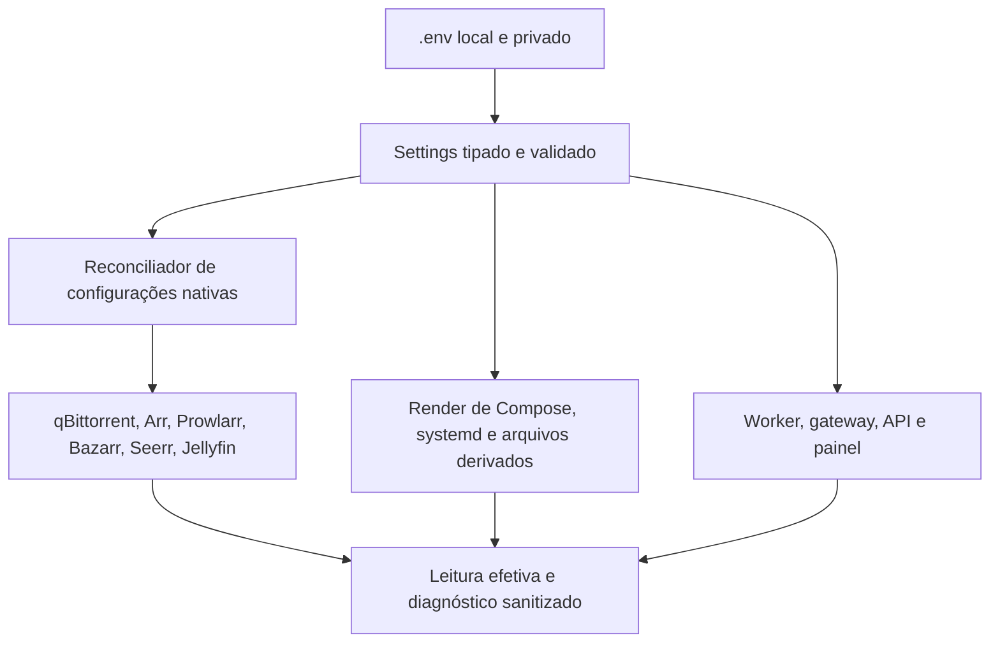

# HomeServer — design de produtização

Data: 2026-09-28. Estado: contrato implementado; [evidências e limites de aceite](../../evidence/productization-acceptance.md).

Origem: [auditoria do código e servidor](../../audits/2026-09-28-homeserver-productization-audit.md). Execução detalhada: [plano](../plans/2026-09-28-homeserver-productization.md).

## 1. Objetivo e decisões de escopo

Permitir que o operador instale, configure, atualize, diagnostique e restaure o HomeServer em outra máquina, seguindo o README e editando um único `.env`. Retirar a CYD. Preservar a aplicação atual, Compose, SQLite, gateway, sequenciamento de séries, exclusão explícita coordenada e painel web.

Baseline proposto: Ubuntu Server 24.04 LTS amd64, systemd e Docker Engine/Compose v2. Python 3.12 e `uv` fixado para desenvolvimento e ferramentas. Reprodução por CPU deve funcionar sem `/dev/dri`; Intel Quick Sync será opcional. Outras distribuições/arquiteturas entram somente depois de teste próprio. Windows/WSL pode desenvolver e receber backups; não é prova de funcionamento do host Linux.

Não introduzir Kubernetes, banco distribuído ou nova stack de observabilidade para atender este escopo. Manter SQLite para uma instalação doméstica, com migrações e restauração verificadas.

## 2. Arquitetura de configuração



### Uma interface editável, vários consumidores

- `.env` é a única interface de configuração **gerenciada pelo projeto**. Defaults pertencem a um schema único; `.env.example` e catálogo são gerados desse schema.
- Configuração de implantação, tuning, políticas de aquisição/legenda e integração dos aplicativos fica no `.env`. Requests, histórico, biblioteca, sessões, preferências individuais dos espectadores e estado operacional continuam nos bancos apropriados; não são duplicados no `.env`.
- Compose/systemd/arquivos exigidos pelos aplicativos são saídas derivadas, não outras fontes que o operador precisa editar. O sistema identifica arquivos gerados e evita sobrescrever arquivos desconhecidos.
- O entrypoint resolve um caminho absoluto para o `.env`, valida uma vez e passa o resultado aos consumidores. Não executar o conteúdo via `source`, `eval` ou interpolação de shell arbitrária. Valores contendo `$`, `#`, aspas e espaços têm testes de round-trip.
- O comando oficial elimina overrides ambientais acidentais de chaves gerenciadas: `.env` explícito prevalece; overrides de CI precisam ser declarados pelo comando e aparecem no plano sanitizado. Não depender da busca implícita por `.env` do Compose. A precedência nativa do Compose dá prioridade ao shell, portanto o wrapper precisa controlar isso. [Documentação Docker](https://docs.docker.com/compose/how-tos/environment-variables/variable-interpolation/).
- Rejeitar chave `HOMESERVER_*` desconhecida, tipo inválido e combinação impossível. Erros citam o nome da chave, nunca seu segredo. Variáveis alheias ao projeto não devem quebrar o processo.
- Segredos podem vir de valor no `.env` ou de `<CHAVE>_FILE`, mutuamente exclusivos. O modo normal não exige espalhar configurações em arquivos manuais; arquivos auxiliares para consumidores são gerados com permissões restritas. Credenciais existentes são importadas em modo adopt sem exposição no terminal.
- Caminhos do host são parametrizados; dentro dos containers, manter contratos estáveis como `/data` e `/var/lib/homeserver`, documentados. Isso reduz remapeamentos e preserva hardlinks.
- Versões de software/digests pertencem à release; opções avançadas de imagem no `.env`, quando suportadas, devem aparecer no plano e satisfazer compatibilidade/manifesto. Não transformar atualização de tag arbitrária em deploy suportado.

### Interface operacional

`scripts/homeserver` entrega os comandos abaixo. Os guias de
[instalação](../../installation.md), [configuração](../../configuration.md) e
[operação](../../operator-guide.md) mostram os argumentos e pré-requisitos reais:

```text
scripts/homeserver env init --env-file PATH --mode dev|prod
scripts/homeserver config validate --env-file PATH
scripts/homeserver config show --redacted --env-file PATH
scripts/homeserver config catalog [--example]
scripts/homeserver config plan|apply|verify --env-file PATH
scripts/homeserver doctor --env-file PATH
scripts/homeserver install plan|apply --mode fresh|adopt --env-file PATH
scripts/homeserver backup create|verify|copy --env-file PATH
scripts/homeserver backup restore --snapshot ID --target PATH --env-file PATH
```

Restore exige um destino isolado vazio; não há promoção automática para os
roots ativos. Deploy/rollback usam `scripts/deploy.sh` e `scripts/rollback.sh`,
com o mesmo loader. `apply` somente altera as chaves pertencentes ao projeto,
verifica o resultado e relata qualquer aplicação parcial; não informa sucesso
silencioso quando um serviço recusou a configuração.

`config plan` mostra valor anterior/novo, consumidor, necessidade de restart e impacto em novas aquisições. Segredos aparecem apenas como definido/ausente/alterado. `config verify` é leitura sem correção automática. Reaplicar o mesmo `.env` produz diff vazio e não reinicia serviços desnecessariamente.

## 3. Catálogo mínimo do `.env`

Todos os nomes abaixo usam prefixo `HOMESERVER_`. As tabelas resumem o contrato;
o schema em `homeserver_common.settings.FIELDS` é a referência implementada.
`config catalog` e `config catalog --example` geram tipo, default, unidade,
segredo, consumidor e modo de aplicação. Preferências só contam como entregues
quando seu consumidor e sua leitura de confirmação estão conectados.

### Identidade, caminhos e acesso

| Chaves sem prefixo | Default/contrato | Consumidores |
|---|---|---|
| `CONFIG_VERSION`, `ENVIRONMENT`, `INSTANCE_NAME`, `TIMEZONE` | `1`, `prod`, `homeserver`, `America/Sao_Paulo`; dev usa fixtures/loopback | Loader, nomes Compose, timers e serviços |
| `INSTALL_ROOT`, `APPDATA_ROOT`, `MEDIA_ROOT`, `TRANSCODE_ROOT`, `BACKUP_STAGING_ROOT` | `/opt/homeserver`, `/srv/appdata`, `/srv/data`, `/srv/transcode`, `/srv/backup-staging` | Installer, volumes, backup e métricas |
| `MEDIA_UUID` | Obrigatório em produção; validado no host | Guarda de disco/admissão |
| `RUN_ROOT` | `/run/homeserver`; arquivos voláteis recriados | Métricas, supervisor |
| `SERVICE_UID`, `SERVICE_GID`, `RENDER_GID`, `VIDEO_GID` | `1000` por default; informar IDs reais do host, grupos GPU só se habilitada | Permissões dos volumes e containers |
| `NETWORK_INTERFACE` | `auto`, ou nome escolhido | Métricas e detecção de endereço; não renomeia NIC |
| `ACCESS_MODE`, `LAN_BIND_IP`, `TAILSCALE_BIND_IP`, `TAILSCALE_HOSTNAME` | `tailscale`; IPs resolvidos/validados na instalação; LAN adicional explícita | Portas e links do painel |
| `JELLYFIN_PORT`, `SEERR_PORT`, `SONARR_PORT`, `RADARR_PORT`, `PROWLARR_PORT`, `BAZARR_PORT`, `CONTROL_PORT`, `STATUS_PORT`, `QBIT_MONITOR_PORT` | 8096, 5055, 8989, 7878, 9696, 6767, 8080, 8081, 18080 | Compose e cards; portas únicas por endereço |
| `<SERVICO>_PUBLIC_URL` | Derivada de acesso/porta; override absoluto http(s) validado | Links do painel, inclusive proxy próprio |
| `QBIT_PEER_PORT`, `QBIT_PEER_BIND_IP` | 6881; bind explícito do host | Porta de peers TCP/UDP, separada da API |
| `TRANSCODE_MODE`, `INTEL_RENDER_DEVICE` | `cpu`; device só obrigatório em `intel` | Compose/Jellyfin/preflight |
| `TRANSCODE_THREADS` | `0` significa automático documentado | Jellyfin e diagnóstico de CPU |

O monitor do qBittorrent continua sendo o painel protegido já existente; seu URL não aponta diretamente para a API nativa. Não abrir portas do roteador. O acesso Tailscale e suas ACLs têm guia próprio e ficam fora do bootstrap de contas dos serviços.

### Downloads, seeding e capacidade

| Chaves sem prefixo | Default inicial | Efeito |
|---|---|---|
| `DOWNLOAD_MAX_ACTIVE` | `4` | `max_active_downloads` do qBittorrent; consumido também pelo planejamento do worker |
| `SEED_MAX_ACTIVE` | `8` | `max_active_uploads`; não muda seleção de episódios |
| `TORRENT_MAX_ACTIVE` | `12` | Limite combinado nativo; compatibilidade com os limites acima validada |
| `QUEUE_IGNORE_SLOW_TORRENTS` | `true` | `dont_count_slow_torrents`; documentar efeito sobre contagem |
| `UPLOAD_LIMIT_MBIT`, `DOWNLOAD_LIMIT_MBIT` | `20`, `0` | Mbit/s decimais; `0` significa ilimitado; conversão central para bytes/s |
| `SEED_RATIO_LIMIT`, `SEED_TIME_LIMIT_MINUTES`, `SEED_INACTIVE_LIMIT_MINUTES` | `-1` em cada chave | Desabilitado explicitamente; mapear versão da API e não remover conteúdo |
| `TORRENT_MAX_CONNECTIONS`, `TORRENT_MAX_CONNECTIONS_PER_TORRENT` | `500`, `100` | Preferências nativas |
| `UPLOAD_SLOTS`, `UPLOAD_SLOTS_PER_TORRENT` | `20`, `4` | Preferências nativas |
| `MOVIE_QUEUE_PRIORITY` | `seeders` | Ordenar filmes elegíveis por disponibilidade, sem furar ordem de séries |
| `SERIES_ORDER` | `sequential` | Único modo suportado nesta fase; temporada/episódio crescente por série |
| `WORKER_INTERVAL_SECONDS`, `SEARCH_RETRY_SECONDS` | `5`, `300` | Intervalo do loop e nova busca elegível; backoff em falha de provedor |
| `SOURCE_STALL_SECONDS`, `SOURCE_SLOW_WINDOW_SECONDS`, `SOURCE_MIN_RATE_KIB` | `300`, `300`, `1024` | Detecção de fonte parada e início de busca após cinco minutos abaixo de 1 MiB/s; buscar não pausa a fonte atual |
| `SOURCE_SEARCH_RETRY_SECONDS`, `SOURCE_PROBE_SECONDS`, `SOURCE_MIN_TIME_GAIN_PERCENT` | `300`, `60`, `20` | Nova busca, amostra de velocidade e vantagem mínima de tempo da substituta |
| `MOVIE_PRIORITY_INTERVAL_SECONDS`, `HTTP_TIMEOUT_SECONDS` | `60`, `15` | Frequência de prioridade e timeout padrão; operações longas com limite próprio |
| `CAPACITY_SNAPSHOT_MAX_AGE_SECONDS` | `30` | Evidência velha bloqueia admissão; validado contra intervalo de coleta |

Os defaults são ponto de partida para instalação nova. **Adopt preserva valores lidos da instalação atual**, inclusive arredondamentos do qBittorrent e retries vigentes; o plano mostra diferenças para os defaults. Não alterar retrospectivamente torrents/limites individuais sem listá-los no diff. Downloads já iniciados não são cancelados apenas porque a preferência de qualidade mudou.

Tamanho e capacidade: verificar tamanho real selecionado e compromissos restantes contra espaço livre atual. Bytes já materializados já reduziram o livre; não descontá-los duas vezes. Deduplicar compromissos por hash/seleção e tratar preallocation/sparse/hardlinks nos testes. Não reintroduzir teto de filme/episódio nem reserva fixa de 80 GB. O ledger interno de capacidade continua existindo para impedir corridas de admissão; isso não é reserva fictícia por título.

A API do qBittorrent permite consultar/aplicar essas preferências; a implementação deve verificar os nomes e comportamentos da versão instalada. [API oficial](https://github.com/qbittorrent/qBittorrent/wiki/WebUI-API-(qBittorrent-5.0)).

### Busca antecipada com continuidade do download

Requisito atualizado pelo usuário em 2026-09-28: **cinco minutos lento já iniciam
a busca**, mantendo o download atual enquanto não houver uma alternativa mais
rápida com qualidade adequada. A regra abaixo foi implementada e testada; sua
ativação em produção precisa da evidência de migração da release. A medição de
uma hora pertence ao baseline auditado, não ao contrato novo.

1. Medir média por bytes efetivamente recebidos durante 300 segundos de atividade, usando relógio e observações persistidos. Pausa pelo operador, espera de capacidade ou episódio anterior não contam como lentidão. O limiar inicial continua 1 MiB/s, editável pelo `.env`.
2. Buscar candidatas do mesmo episódio/filme em paralelo ao download atual, com backoff. Uma busca vazia/indisponível mantém a fonte ativa. Reconsultar o estado antes de avaliar: se a fonte terminou ou recuperou velocidade, abandonar a substituição.
3. Filtrar por política de qualidade, resolução, edição, arquivos e legenda. A candidata não pode ter nível de fonte ou resolução inferiores à atual nessa troca por desempenho. Seeds e disponibilidade de trackers servem para triagem; não são prova de MB/s.
4. Para comprovar desempenho, permitir uma avaliação temporária e limitada de **uma candidata do mesmo episódio**, autorizada pelo gateway e com compromisso de capacidade para seus bytes reais além dos pendentes da atual. Nunca iniciar episódios seguintes como teste. Na falta de espaço, continuar apenas a atual.
5. Medir por 60 segundos depois de obter metadata/peers; comparar tempo restante estimado de ambas, com os bytes restantes atualizados. Trocar somente se a candidata tiver velocidade sustentada maior e projeção de término pelo menos 20% menor. Janela de teste e margem são defaults configuráveis; contagem de seeds isolada não habilita a troca.
6. A fonte atual permanece principal durante busca/avaliação. Somente promover candidata já ativa e validada; depois parar a anterior sob transição persistida. Rejeição/erro da candidata não pode deixar as duas fontes paradas. Preservar arquivos existentes, registrar artefatos de tentativas e não introduzir exclusão automática de mídia.
7. Reavaliar conclusão, cancelamento/exclusão pelo usuário, UUID e capacidade em cada transição. Uma fonte concluída/importada encerra a avaliação; cancelamento impede qualquer retomada automática.

Na ativação inicial, o download de **The Rookie S02E04**, em andamento quando a regra foi solicitada, fica isento desta mudança até terminar. Identificar e persistir a exceção por aquisição no estado local, incluindo proteção após reinício do worker; não inserir IDs privados no exemplo público do `.env`. A exceção não é uma configuração geral permanente nem cobre os próximos episódios. Se o episódio já tiver terminado antes da implantação, registrar a condição e não executar nenhuma ação sobre ele.

Assim, a busca começa cedo sem descartar progresso com base apenas em seeds anunciados. A implementação precisa distinguir `buscando candidata`, `avaliando candidata` e `substituição confirmada`; alterar apenas a duração da janela não entrega essa garantia.

### Qualidade, áudio e legendas

| Chaves sem prefixo | Default inicial | Contrato |
|---|---|---|
| `MEDIA_RESOLUTIONS` | `2160,1080` | Lista ordenada; suportar 720, 1080 e 2160; perfil Arr e seletor usam o mesmo valor |
| `MEDIA_SOURCES` | `remux,bluray,webdl` | Ordem de preferência; não aceitar fonte abaixo de WEB-DL por default |
| `QUALITY_MIN_MIB_PER_MIN_720`, `QUALITY_MIN_MIB_PER_MIN_1080`, `QUALITY_MIN_MIB_PER_MIN_2160` | `10`, `20`, `50` | Piso de bytes do vídeo principal por minuto; zero desativa o piso da resolução, sem teto máximo |
| `PREFER_DOLBY_VISION`, `PREFER_ATMOS` | `true`, `true` | Preferências, não requisitos eliminatórios |
| `AUDIO_LANGUAGES` | `original` | Lista ordenada de preferências; somente metadados declarados da release pontuam e `original` exige contexto Arr |
| `AUTOMATIC_UPGRADES` | `false` | Controla perfis Arr e decisão do worker de forma consistente |
| `SUBTITLE_LANGUAGES` | `pt-BR,en-US` | Preferência ordenada; normalização por provedor, sem confundir pt-BR com pt-PT |
| `SUBTITLE_MATCH_MODES` | `release,compatible_edition` | Para cada idioma, tentar mesma release e depois edição/duração compatíveis |
| `SUBTITLE_SKIP_ORIGINAL_AUDIO_LANGUAGES` | `pt-BR` | Apenas pt-BR tem detector de original nesta versão; vazio desativa, dublagem não dispensa |
| `SUBTITLE_ALLOW_GENERIC_ENGLISH` | `true` | Preferir en-US; aceitar inglês genérico quando provedor não distingue região, relatando a origem |
| `SUBTITLE_CREDITS_MARGIN_SECONDS` | `600` | Margem para créditos finais, configurável; não prova sincronismo |
| `SUBTITLE_PROVIDERS` | `bazarr,subdl` | Lista de integrações de busca habilitadas; backend não configurado fica explícito |
| `BAZARR_PROVIDERS` | `subdl,opensubtitlescom` | Aplicar somente provedores com configuração válida |
| `SUBDL_API_KEY`, `OPENSUBTITLES_USERNAME`, `OPENSUBTITLES_PASSWORD` | Segredos opcionais conforme provedor | Integrações nativas e fallback do worker |

A sequência padrão continua **pt-BR mesma release → pt-BR edição compatível → inglês mesma release → inglês edição compatível**. A duração serve para evitar extended/director's cut incompatível, aceitando margem de créditos. Tempos de SRT não provam a duração exata do vídeo nem garantem sincronismo: preservar identificação de edição, evitar prometer essa certeza e oferecer override manual documentado.

Os pisos de qualidade conferem o vídeo principal inspecionado no torrent,
sem somar samples/sidecars, e a duração declarada do filme/episódio. Duração
desconhecida não comprova um piso habilitado; candidata assim não recebe nova
aquisição ou probe. As definições de qualidade Arr usam os mesmos mínimos e
máximo ilimitado. Áudio desconhecido não elimina a release nem recebe
preferência; uma tag genérica não comprova região específica.

Sonarr/Radarr mantêm `enableCompletedDownloadHandling=false` e
`copyUsingHardlinks=true`. Esses invariantes preservam validação/importação
pelo worker e seeding sem duplicar o vídeo; não são preferências editáveis.
O operator preserva IDs/chaves estrangeiras e confirma os valores por read-back.

Não anunciar suporte a um idioma só porque a variável aceita uma string: o registro de idiomas, sufixos, detecção, persistência e os provedores precisam suportá-lo. Idioma sem suporte retorna erro claro. A seleção de releases respeita primeiro elegibilidade/qualidade; a ordenação dos filmes já elegíveis na fila pode favorecer seeds. Séries sempre mantêm a sequência.

### Integrações, serviços e observabilidade

| Chaves sem prefixo | Contrato |
|---|---|
| `<SERVICO>_URL`, `<SERVICO>_API_KEY` | Seerr, Jellyfin, Sonarr, Radarr, Prowlarr e Bazarr; URLs internas default por DNS Compose; chaves geradas/importadas no onboarding |
| `ARR_TOKEN`, `ADMIN_TOKEN`, `CSRF_TOKEN`, `COLLECTOR_TOKEN` | Gerados no init; sem default compartilhado de produção; removê-los somente quando consumidor correspondente deixar de existir |
| `ADMIN_USERNAME`, `ADMIN_PASSWORD` | Conta inicial configurável; adopt não redefine credenciais sem diff explícito; senha nunca no exemplo versionado |
| `QBIT_USERNAME`, `QBIT_PASSWORD` | Conta nativa usada pelo gateway; arquivo exigido pelo adapter pode ser gerado a partir do `.env` |
| `PROWLARR_INDEXERS` | Lista/JSON compacto com identificadores de definição, URL e opções por indexador; validação e reconciliação sem duplicar IDs |
| `BYPARR_ENABLED`, `BYPARR_URL` | Opcional; sem exigir browser auxiliar quando nenhum indexador depende dele |
| `METRICS_INTERVAL_SECONDS`, `METRICS_MAX_AGE_SECONDS` | `5`, `90`; relação entre ambos validada |
| `LOG_LEVEL`, `LOG_MAX_SIZE_MB`, `LOG_MAX_FILES` | `INFO`, `10`, `3`; rotação Compose gerada, logs de auditoria com segredos ocultos |
| `BACKUP_ENABLED`, `BACKUP_SCHEDULE`, `BACKUP_REPOSITORY`, `BACKUP_PASSWORD` | Ativação, calendário systemd, destino Restic e segredo; sem senha compartilhada de exemplo |
| `BACKUP_KEEP_LAST`, `BACKUP_KEEP_DAILY`, `BACKUP_KEEP_WEEKLY`, `BACKUP_KEEP_MONTHLY` | Retenção explícita por papel do repositório; origem e destino têm `.env` próprios |
| `BACKUP_TARGET_REPOSITORY`, `BACKUP_TARGET_PASSWORD`, `BACKUP_SSH_HOST`, `BACKUP_SSH_USER`, `BACKUP_SSH_KEY_FILE` | Transporte externo; nenhum usuário/IP pessoal hardcoded |
| `BACKUP_STALE_HOURS`, `BACKUP_STAGING_MAX_GIB`, `RELEASE_KEEP_COUNT` | Idade máxima, alerta/limite de staging e retenção de releases; proteger release atual/anterior |
| `ALERTS_ENABLED`, `ALERT_WEBHOOK_URL`, `ALERT_RETRY_SECONDS` | Canal opcional implementado/testado; não declarar entrega de alerta apenas porque existe uma classe |

Configuração do destinatário de backup pertence ao `.env` da máquina que executa o pull, não ao Git. Caso o proprietário mantenha o destino Windows atual, ele é importado localmente e parametrizado.

Não haverá opção para desabilitar validação de hash, contenção de caminhos, integridade do gateway ou guarda de montagem em produção. São invariantes da implementação. Formatos de protocolo e constantes de proteção não precisam se tornar tuning; todo parâmetro operacional editável precisa.

## 4. Retirada da CYD

1. Retirar `firmware/cyd`, runbook de flash, contrato CYD e referências normativas ao display. O histórico Git já preserva esse material.
2. Verificar clientes/consumidores MQTT. O código auditado não compõe publisher no runtime; investigar a instalação antes da desativação do broker.
3. Sem consumidores remanescentes, remover broker, volumes específicos, certificados/ACLs, portas e segredos CYD da stack ativa. Preservar backup dos arquivos existentes durante migração; não apagar mídia nem fazer limpeza genérica de volumes Docker.
4. Manter coleta Linux, status web, cards, capacidade e alertas realmente ligados. Remover ou substituir `/api/v1/telemetry` antigo de forma documentada; não conservar uma rota prometida que só devolve 503.
5. Atualizar testes e design vigente. Marcar especificações/planos anteriores como históricos, sem reescrever evidências passadas.

## 5. Instalação, execução e upgrades

- `fresh`: host com SO, acesso administrativo, Docker/Compose e filesystem de mídia previamente montado; README fornece os passos de pré-requisitos. Installer configura diretórios/identidades, `.env`, templates, serviços e integrações. Pré-requisitos ausentes geram instrução verificável; a etapa opcional de instalação de pacotes é separada e explícita.
- `adopt`: inventaria, produz diff, importa valores/IDs existentes e instala somente o que falta. Não cria outra biblioteca ou outro cliente de download equivalente.
- GPU: overlays/perfis opcionais para Intel; Compose renderiza sem device em CPU. A ativação de serviços opcionais pode usar [profiles do Compose](https://docs.docker.com/compose/how-tos/profiles/), sem tornar core dependente de um perfil desligado.
- Supervisor: reconciliar serviços permitidos apenas após validação de montagem; parar admissão/serviços de escrita ao perder o disco. Testar boot, queda individual e retorno do disco. Backup e manutenção não podem disputar o supervisor para religar containers durante uma captura.
- Release: build reproduzível, imagens por digest, manifesto associado ao commit e configuração sanitizada. CI e execução manual usam o mesmo deploy, com lock, preflight, backup quando exigido, migração, ativação e smoke.
- Rollback: restaurar imagens/configuração anterior e somente schema compatível. Quando exigir restauração de banco, entrar em recovery e seguir procedimento explícito; nenhuma reversão automática de dados de mídia.

## 6. Backup e recuperação

Unificar a rotina real de Restic com os testes. Capturar todos os volumes persistentes necessários e ledger do controle, incluindo tombstones de exclusão. Diferenciar backup de configuração/estado de backup de mídia; mídia permanece excluída por default e isso precisa aparecer claramente no README.

Migrar transferência para `restic copy` entre repositórios com credenciais/transporte compatíveis, ou implementar exportação/espelho consistente sob coordenação. Não executar prune independente em uma cópia viva sem definir o protocolo de sincronização. Em nenhum caso apagar o backup atual para começar o novo.

Restaurar em diretório isolado, verificar integridade e bancos, entrar em `RECOVERY_MODE`, comparar mídia realmente existente com estado restaurado e liberar admissão somente depois de reconciliação. Registrar RPO/RTO medidos no ensaio; não inventar garantias antes dele. [Restore Restic](https://restic.readthedocs.io/en/stable/050_restore.html).

## 7. Estrutura da documentação final

README deverá apresentar: propósito e componentes; fluxo de uma request; plataforma suportada; instalação nova; adoção; criação do `.env`; configuração inicial; URLs de acesso; comandos diários; verificação; atualização; backup/restore; diagnóstico; desenvolvimento; links para limites conhecidos.

Guias atuais em `docs/`: `installation.md`, `configuration.md`, `architecture.md`, `operations.md`, `troubleshooting.md`, `development.md`. Runbooks especializados permanecem ligados por esses guias, sem repetir valores mutáveis. `docs/evidence` e planos antigos ficam identificados como histórico.

Documentar estados de fila e motivos: aguardando pesquisa, sem fonte elegível, sem espaço, aguardando episódio anterior, baixando, finalizando/legenda, importando, disponível, falhou e próxima tentativa. Usar nomes correspondentes ao modelo real ou fornecer mapeamento explícito; não inventar estados que a API não emite.

## 8. Critério global de prontidão

Em VM Ubuntu limpa, uma pessoa deve seguir o README, criar o `.env`, iniciar o core sem CYD/GPU, alterar concorrência/idioma/resolução, verificar efeitos nos serviços, completar um fluxo de mídia de teste autorizada, atualizar, recuperar uma falha e restaurar backup isolado. Tudo sem editar YAML/Python, copiar bancos pessoais para o Git ou depender de uma pasta particular do desktop atual.

Na instalação existente, a mesma versão precisa preservar pedidos, IDs, bibliotecas, arquivos, sequência de episódios e acesso Tailscale. Configurações importadas permanecem equivalentes até o operador aplicar um diff de mudança.
